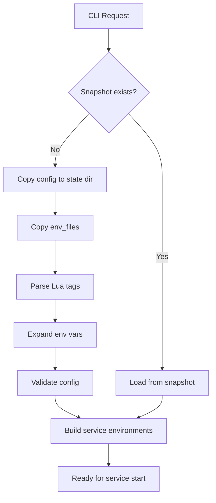
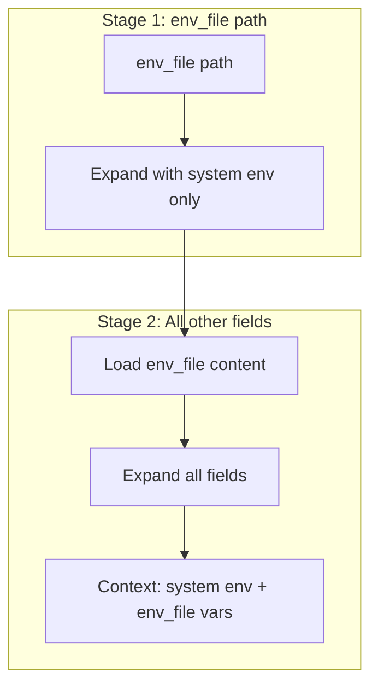
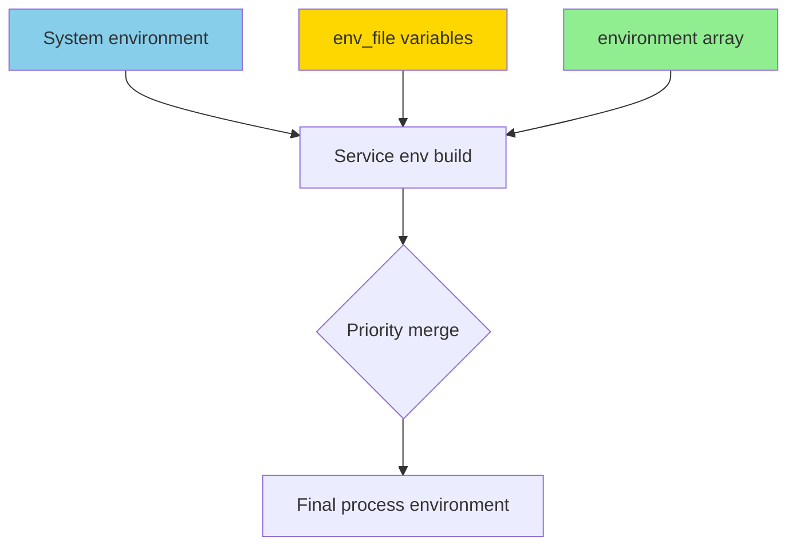
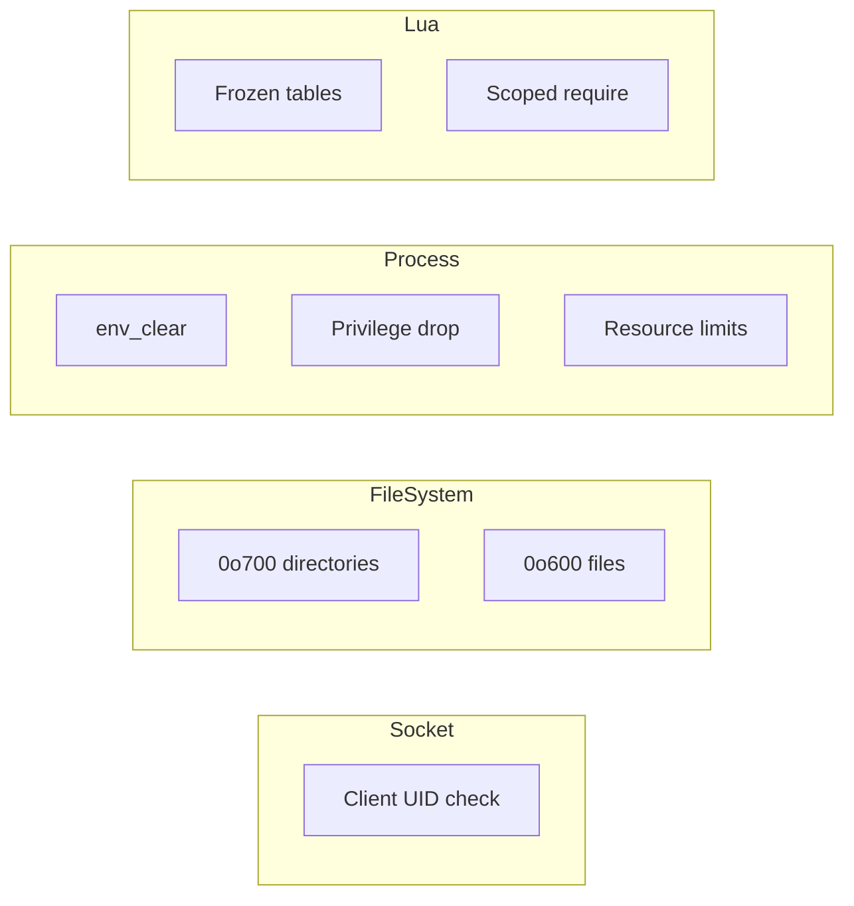

# Kepler Architecture

This document describes Kepler's internal implementation, security measures, and design decisions. It is intended for contributors and developers who want to understand or modify the codebase.

## Table of Contents

- [Introduction](#introduction)
- [File Storage and Directory Structure](#file-storage-and-directory-structure)
- [Socket Security](#socket-security)
- [Configuration Lifecycle](#configuration-lifecycle)
- [Environment Variable Handling](#environment-variable-handling)
- [Lua Scripting Security](#lua-scripting-security)
- [Process Security](#process-security)

---

## Introduction

### Global Daemon Pattern

Kepler uses a single global daemon architecture. One daemon process manages all configurations and services for a user:

- **Single socket**: `~/.kepler/kepler.sock` handles all CLI communication
- **Per-config isolation**: Each config gets its own state directory (hashed path)
- **Persistent state**: Daemon survives CLI disconnections, services continue running

### Key Design Principles

1. **Security by default**: Restrictive file permissions, same-user enforcement, environment isolation
2. **Configuration immutability**: Configs are "baked" on first service start
3. **Single evaluation**: Lua scripts and env vars expanded once, results persisted
4. **Graceful recovery**: State persisted to disk, restorable after daemon restart

---

## File Storage and Directory Structure

### Location

The daemon stores all state in `~/.kepler/` (or `$KEPLER_DAEMON_PATH` if set):

```
~/.kepler/
├── kepler.sock           # Unix domain socket (0o600)
├── kepler.pid            # Daemon PID file (0o600)
└── configs/              # Per-config state directories
    └── <config-hash>/
        ├── config.yaml         # Copied config (immutable after snapshot)
        ├── expanded_config.yaml  # Snapshot with resolved env vars
        ├── state.json          # Runtime service state
        ├── source_path.txt     # Original config location
        └── env_files/          # Copied env files
```

### Security

- **State directory**: `0o700` (owner-only access)
- **All files**: `0o600` (owner read/write only)
- **Purpose**: Prevents other users from reading sensitive config data

### Relevant Files

| File | Description |
|------|-------------|
| `kepler-daemon/src/lib.rs` | Directory structure constants and path helpers |
| `kepler-daemon/src/main.rs` | Secure directory creation with `0o700` mode |
| `kepler-daemon/src/persistence.rs` | Secure file writing with `0o600` mode |

---

## Socket Security

### Same-User Protection

The daemon uses Unix peer credentials to enforce same-user access:

1. Socket file permissions set to `0o600`
2. Each connection verified via `peer_cred()`
3. Client UID compared against daemon UID
4. Connections from different users rejected

### Relevant Files

| File | Description |
|------|-------------|
| `kepler-protocol/src/server.rs` | Socket permissions and UID verification |

---

## Configuration Lifecycle

### Config Loading Flow



### Config Initialization

When a config is loaded:

1. **CLI requests config** from daemon
2. **Daemon checks** for existing snapshot in state directory
3. **If no snapshot exists**:
   - Copy config file to state directory
   - Copy env_files to state directory
   - Parse and expand Lua tags
   - Expand environment variables
   - Validate configuration
4. **If snapshot exists**:
   - Load from snapshot (skip re-expansion)
   - Restore service environments from snapshot

### Config Immutability ("Baking")

- Config copied to state directory on first load
- Original config can be modified, but daemon uses the copy
- **Snapshot taken on first service start** - this "bakes" the config
- To update: reload via CLI (re-copies and re-expands)

### Relevant Files

| File | Description |
|------|-------------|
| `kepler-daemon/src/config_actor.rs` | Config initialization and snapshot management |
| `kepler-daemon/src/persistence.rs` | Snapshot persistence to disk |

---

## Environment Variable Handling

### Shell Expansion Syntax

Kepler supports shell-style variable expansion:

| Syntax | Description |
|--------|-------------|
| `${VAR}` | Variable expansion |
| `${VAR:-default}` | Default value if unset or empty |
| `${VAR:+value}` | Conditional value (use if VAR is set) |
| `~` | Home directory expansion |

### Two-Stage Expansion



1. **`env_file` path expanded first** (using system env only)
2. **All other fields expanded** (using system env + env_file vars)

### What IS Expanded at Config Time

- `working_dir`, `env_file`, `user`, `group`
- `environment` array entries
- `limits.memory`, `restart.watch` patterns

### What is NOT Expanded (Shell Expands at Runtime)

- `command` and `hooks.run/command`
- `healthcheck.test`

### Environment Priority

When building service environment (highest to lowest priority):



1. **Service `environment` array** (highest priority)
2. **Service `env_file` variables**
3. **System environment variables** (lowest priority)

### Relevant Files

| File | Description |
|------|-------------|
| `kepler-daemon/src/config.rs` | Two-stage shell expansion logic |
| `kepler-daemon/src/env.rs` | Environment building and priority merging |

---

## Lua Scripting Security

### Luau Sandbox

Kepler uses the `mlua` crate with Luau for config templating. Luau is a sandboxed Lua 5.1 derivative designed for secure embedded scripting.

### Sandboxed Standard Library

The Lua environment provides a **restricted subset** of the standard library:

| Available | NOT Available |
|-----------|---------------|
| `string` - String manipulation | `io` - File I/O operations |
| `math` - Mathematical functions | `os.execute` - Shell command execution |
| `table` - Table manipulation | `os.remove`, `os.rename` - File operations |
| `tonumber`, `tostring` | `loadfile`, `dofile` - Arbitrary file loading |
| `pairs`, `ipairs` | `debug` - Debug library |
| `type`, `select`, `unpack` | `package.loadlib` - Native library loading |

**No filesystem access**: Scripts cannot read, write, or modify files on disk.

**No command execution**: Scripts cannot spawn processes or execute shell commands.

**No network access**: Scripts cannot make network requests.

### Available Context

| Symbol | Description |
|--------|-------------|
| `ctx.env` | Read-only full environment (system + env_file + service) |
| `ctx.sys_env` | Read-only system environment only |
| `ctx.env_file` | Read-only env_file variables only |
| `ctx.service_name` | Current service name (nil if global) |
| `ctx.hook_name` | Current hook name (nil outside hooks) |
| `global` | Mutable shared table for cross-block state |
| `require()` | Load Lua files **only** from config directory |

### Security Measures

- **Environment tables frozen** via metatable proxy pattern
- **Writes to `ctx.*` tables raise runtime errors**
- **Metatables protected** from removal
- **`require()` path scoped** to config directory only (cannot escape to parent directories)

### Single Evaluation

- Lua scripts evaluated **once** when config is first loaded
- Results "baked" into the configuration
- No runtime re-evaluation
- Global state persists across all evaluations in a single config load

### Relevant Files

| File | Description |
|------|-------------|
| `kepler-daemon/src/lua_eval.rs` | LuaEvaluator, frozen table pattern, sandbox setup |

---

## Process Security

### Security Layers Overview



### Root Execution Prevention

Running the daemon as root is blocked by default for security. The `--allow-root` flag can override this (not recommended).

### Privilege Dropping

Services can run as specific user/group:

- User formats: `"username"`, `"1000"`, `"1000:1000"`
- Hooks inherit service user by default (can override)

### Environment Isolation

- `env_clear()` removes all inherited environment
- Only explicitly specified variables passed to processes
- Prevents accidental secret leakage from daemon environment

### Resource Limits

Applied via `pre_exec` before process execution:

| Limit | Description |
|-------|-------------|
| `RLIMIT_AS` | Memory limits |
| `RLIMIT_CPU` | CPU time limits |
| `RLIMIT_NOFILE` | File descriptor limits |

### Relevant Files

| File | Description |
|------|-------------|
| `kepler-daemon/src/main.rs` | Root execution prevention |
| `kepler-daemon/src/process.rs` | Process spawning, privilege dropping, resource limits |
| `kepler-daemon/src/user.rs` | User/group resolution |

---

## Key Files Reference

| Component | File | Description |
|-----------|------|-------------|
| Directory structure | `kepler-daemon/src/lib.rs` | State directory paths |
| Secure file writing | `kepler-daemon/src/persistence.rs` | File permissions |
| Socket security | `kepler-protocol/src/server.rs` | UID verification |
| Config loading | `kepler-daemon/src/config_actor.rs` | Lifecycle management |
| Env expansion | `kepler-daemon/src/config.rs` | Shell-style expansion |
| Env building | `kepler-daemon/src/env.rs` | Priority merging |
| Lua evaluation | `kepler-daemon/src/lua_eval.rs` | Sandbox implementation |
| Process spawning | `kepler-daemon/src/process.rs` | Security controls |
