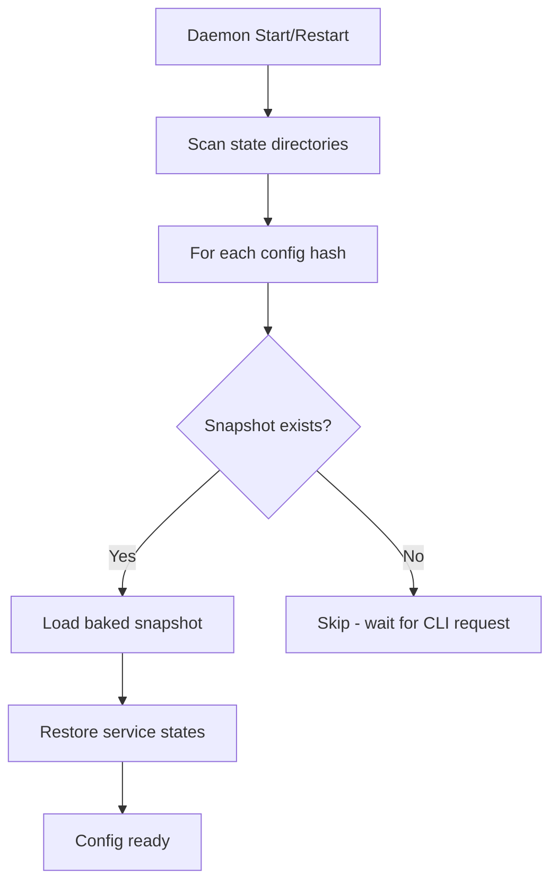
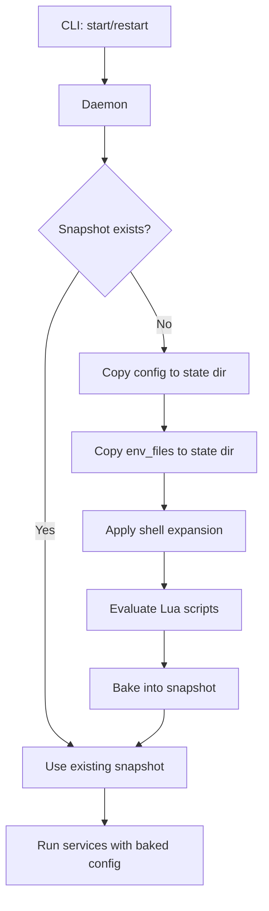
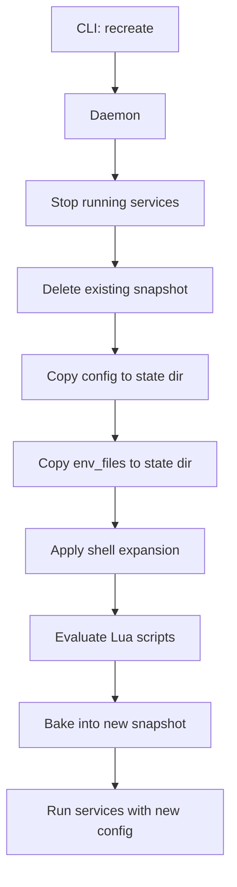
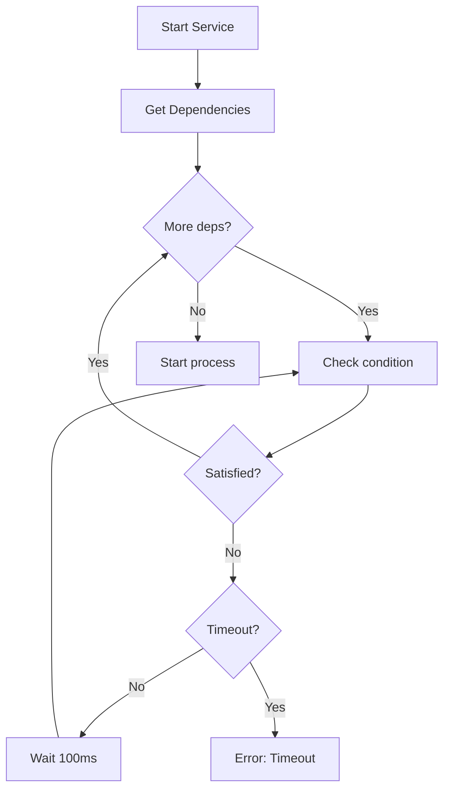
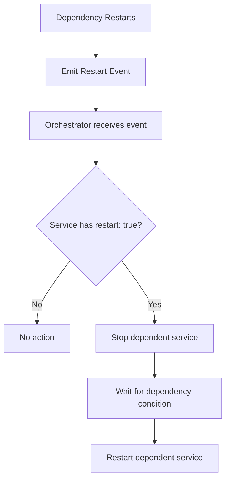
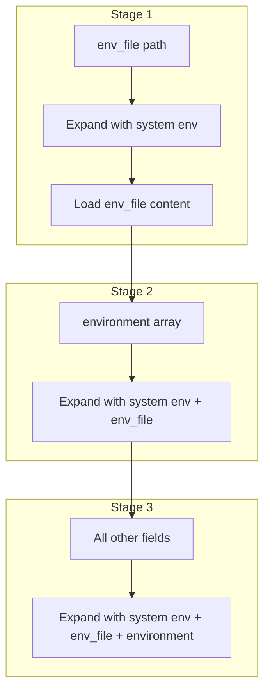

# Kepler Architecture

This document describes Kepler's internal implementation, security measures, and design decisions. It is intended for contributors and developers who want to understand or modify the codebase.

## Table of Contents

- [Introduction](#introduction)
- [File Storage and Directory Structure](#file-storage-and-directory-structure)
- [Socket Security](#socket-security)
- [Configuration Lifecycle](#configuration-lifecycle)
- [Event-Driven Architecture](#event-driven-architecture)
- [Dependency Management](#dependency-management)
- [Environment Variable Handling](#environment-variable-handling)
- [Lua Scripting Security](#lua-scripting-security)
- [Process Security](#process-security)
- [Log Storage](#log-storage)

---

## Introduction

### Global Daemon Pattern

Kepler uses a single global daemon architecture. One daemon process manages all configurations and services for a user:

- **Single socket**: `~/.kepler/kepler.sock` handles all CLI communication
- **Per-config isolation**: Each config gets its own state directory (hashed path)
- **Persistent state**: Daemon survives CLI disconnections, services continue running

### Key Design Principles

1. **Security by default**: Restrictive file permissions, same-user enforcement, environment isolation
2. **Configuration immutability**: Configs are "baked" on first service start
3. **Single evaluation**: Lua scripts and env vars expanded once, results persisted
4. **Graceful recovery**: State persisted to disk, restorable after daemon restart

---

## File Storage and Directory Structure

### Location

The daemon stores all state in `~/.kepler/` (or `$KEPLER_DAEMON_PATH` if set):

```
~/.kepler/
├── kepler.sock           # Unix domain socket (0o600)
├── kepler.pid            # Daemon PID file (0o600)
└── configs/              # Per-config state directories
    └── <config-hash>/
        ├── config.yaml         # Copied config (immutable after snapshot)
        ├── expanded_config.yaml  # Snapshot with resolved env vars
        ├── state.json          # Runtime service state
        ├── source_path.txt     # Original config location
        └── env_files/          # Copied env files
```

### Security

- **State directory**: `0o700` (owner-only access)
- **All files**: `0o600` (owner read/write only)
- **Purpose**: Prevents other users from reading sensitive config data

### Relevant Files

| File | Description |
|------|-------------|
| `kepler-daemon/src/lib.rs` | Directory structure constants and path helpers |
| `kepler-daemon/src/main.rs` | Secure directory creation with `0o700` mode |
| `kepler-daemon/src/persistence.rs` | Secure file writing with `0o600` mode |

---

## Socket Security

### Same-User Protection

The daemon uses Unix peer credentials to enforce same-user access:

1. Socket file permissions set to `0o600`
2. Each connection verified via `peer_cred()`
3. Client UID compared against daemon UID
4. Connections from different users rejected

### Relevant Files

| File | Description |
|------|-------------|
| `kepler-protocol/src/server.rs` | Socket permissions and UID verification |

---

## Configuration Lifecycle

### Daemon Startup

When the daemon starts or restarts, it discovers and loads all previously known configs from their snapshots:



### CLI Config Request

When the CLI requests to start/restart a config:



### CLI Recreate Command

The `recreate` command forces a full re-bake, discarding the existing snapshot:



Use `recreate` when:
- The original config file has changed
- Environment variables have changed
- env_files have been modified

### Config Baking Process

When no snapshot exists (or after `recreate`), the config goes through a baking process:

1. **Copy files**: Config and env_files copied to state directory
2. **Shell expansion**: Environment variables expanded (see [Environment Variable Handling](#environment-variable-handling))
3. **Lua evaluation**: `!lua` and `!lua_file` tags executed, return values substituted
4. **Snapshot creation**: Final expanded config saved as `expanded_config.yaml`

Once baked, the snapshot is immutable. Services always run using the baked snapshot, never the original config file.

### Relevant Files

| File | Description |
|------|-------------|
| `kepler-daemon/src/config_actor.rs` | Config initialization and snapshot management |
| `kepler-daemon/src/persistence.rs` | Snapshot persistence to disk |

---

## Event-Driven Architecture

Kepler uses an event-driven architecture for service lifecycle management. Each service emits events at various lifecycle stages, enabling features like restart propagation and health monitoring.

### Service Events

Services emit events at the following lifecycle points:

| Event | Description |
|-------|-------------|
| `Init` | Before `on_init` hook runs (first start only) |
| `Start` | Before `on_start` hook runs |
| `Restart` | Before service restarts (with reason) |
| `Exit` | When process exits (with exit code) |
| `Stop` | Before `on_stop` hook runs |
| `Cleanup` | Before `on_cleanup` hook runs |
| `Healthcheck` | After each health check (with status) |
| `Healthy` | When service transitions to healthy |
| `Unhealthy` | When service transitions to unhealthy |

### Restart Reasons

When a service restarts, the event includes the reason:

| Reason | Description |
|--------|-------------|
| `Watch` | File watcher triggered restart |
| `Failure` | Process exited with error (includes exit code) |
| `Manual` | User requested restart via CLI |
| `DependencyRestart` | Dependency restarted (includes dependency name) |

### Per-Service Event Channels

Each service has a dedicated SPSC (Single Producer, Single Consumer) event channel:

```
┌─────────────┐                            ┌──────────────────────┐
│  Service A  │ ──► [SPSC A (cap: 100)] ──►│                      │
└─────────────┘                            │                      │
                                           │    Orchestrator      │
┌─────────────┐                            │                      │
│  Service B  │ ──► [SPSC B (cap: 100)] ──►│   - Event handling   │
└─────────────┘                            │   - Restart prop.    │
                                           │                      │
┌─────────────┐                            │                      │
│  Service C  │ ──► [SPSC C (cap: 100)] ──►│                      │
└─────────────┘                            └──────────────────────┘
```

**Benefits:**
- **Isolation**: One misbehaving service can't flood others
- **Backpressure**: Per-service buffer quotas prevent noisy neighbor issues
- **Fairness**: Each service has guaranteed capacity for events

### Relevant Files

| File | Description |
|------|-------------|
| `kepler-daemon/src/events.rs` | ServiceEvent types, channel creation |
| `kepler-daemon/src/config_actor.rs` | Event channel management per service |
| `kepler-daemon/src/orchestrator.rs` | ServiceEventHandler, event processing |

---

## Dependency Management

Kepler supports Docker Compose-compatible dependency configuration with conditions, timeouts, and restart propagation.

### Dependency Conditions

Services can specify conditions that must be met before starting:

| Condition | Description |
|-----------|-------------|
| `service_started` | Dependency status is Running, Healthy, or Unhealthy (default) |
| `service_healthy` | Dependency status is Healthy (requires healthcheck) |
| `service_completed_successfully` | Dependency exited with code 0 (for init containers) |

### Dependency Waiting

When a service starts, it waits for all dependencies to satisfy their conditions:



### Restart Propagation

When `restart: true` is set in a dependency configuration, the dependent service restarts when its dependency restarts:



**Example:**
```yaml
services:
  database:
    command: ["postgres"]
    healthcheck:
      test: ["pg_isready"]

  backend:
    command: ["./server"]
    depends_on:
      database:
        condition: service_healthy
        restart: true  # Backend restarts when database restarts
```

When the database restarts:
1. Backend is stopped
2. System waits for database to become healthy
3. Backend is restarted

### Configuration Format

Kepler supports both simple and extended dependency formats:

**Simple format (backward compatible):**
```yaml
depends_on:
  - service-a
  - service-b
```

**Extended format (Docker Compose compatible):**
```yaml
depends_on:
  service-a:
    condition: service_healthy
    timeout: 30s
    restart: true
  service-b:
    condition: service_started
```

### Relevant Files

| File | Description |
|------|-------------|
| `kepler-daemon/src/config.rs` | DependencyCondition, DependencyConfig, DependsOn types |
| `kepler-daemon/src/deps.rs` | Dependency graph, start/stop ordering, condition checking |
| `kepler-daemon/src/orchestrator.rs` | Dependency waiting, restart propagation |

---

## Environment Variable Handling

### Shell Expansion Syntax

Kepler supports shell-style variable expansion:

| Syntax | Description |
|--------|-------------|
| `${VAR}` | Variable expansion |
| `${VAR:-default}` | Default value if unset or empty |
| `${VAR:+value}` | Conditional value (use if VAR is set) |
| `~` | Home directory expansion |

### Three-Stage Expansion

Shell expansion happens in three stages, each building on the previous context:



| Stage | What is expanded | Expansion context |
|-------|------------------|-------------------|
| 1 | `env_file` path | System environment only |
| 2 | `environment` array entries | System env + env_file variables |
| 3 | `working_dir`, `user`, `group`, `limits.memory`, `restart.watch` | System env + env_file + environment array |

### What is NOT Expanded

These fields are intentionally **not** expanded at config time. The shell expands them at runtime using the process environment:

- `command`
- `hooks.run` / `hooks.command`
- `healthcheck.test`

This ensures commands work as users expect (shell expansion at runtime) and values are passed consistently through environment variables.

### Environment Priority (Runtime)

When building the final process environment for a service (highest to lowest priority):

1. **Service `environment` array** (highest priority)
2. **Service `env_file` variables**
3. **System environment variables** (lowest priority)

Higher priority values override lower priority ones when keys conflict.

### Relevant Files

| File | Description |
|------|-------------|
| `kepler-daemon/src/config.rs` | Two-stage shell expansion logic |
| `kepler-daemon/src/env.rs` | Environment building and priority merging |

---

## Lua Scripting Security

### Luau Sandbox

Kepler uses the `mlua` crate with Luau for config templating. Luau is a sandboxed Lua 5.1 derivative designed for secure embedded scripting.

### Sandboxed Standard Library

The Lua environment provides a **restricted subset** of the standard library:

| Available | NOT Available |
|-----------|---------------|
| `string` - String manipulation | `io` - File I/O operations |
| `math` - Mathematical functions | `os.execute` - Shell command execution |
| `table` - Table manipulation | `os.remove`, `os.rename` - File operations |
| `tonumber`, `tostring` | `loadfile`, `dofile` - Arbitrary file loading |
| `pairs`, `ipairs` | `debug` - Debug library |
| `type`, `select`, `unpack` | `package.loadlib` - Native library loading |

**No filesystem access**: Scripts cannot read, write, or modify files on disk.

**No command execution**: Scripts cannot spawn processes or execute shell commands.

**No network access**: Scripts cannot make network requests.

### Available Context

| Symbol | Description |
|--------|-------------|
| `ctx.env` | Read-only full environment (system + env_file + service) |
| `ctx.sys_env` | Read-only system environment only |
| `ctx.env_file` | Read-only env_file variables only |
| `ctx.service_name` | Current service name (nil if global) |
| `ctx.hook_name` | Current hook name (nil outside hooks) |
| `global` | Mutable shared table for cross-block state |
| `require()` | Load Lua modules from config directory (checked first) or system Lua paths |

### Security Measures

- **Environment tables frozen** via metatable proxy pattern
- **Writes to `ctx.*` tables raise runtime errors**
- **Metatables protected** from removal
- **`require()` path includes config directory** (prepended to system Lua paths for convenient module loading). This is safe because:
  - Lua is evaluated **once** during config baking, not at runtime
  - Users running configs must have the same access as the Daemon
  - Luau's sandbox prevents filesystem and network access regardless of loaded modules

### Single Evaluation

- Lua scripts evaluated **once** when config is first loaded
- Results "baked" into the configuration
- No runtime re-evaluation
- Global state persists across all evaluations in a single config load

### Execution Order

Lua scripts run in a specific order that mirrors shell expansion, with `ctx.env` progressively building up:

| Order | Block | `ctx.env` contains |
|-------|-------|-------------------|
| 1 | `lua:` directive | System env only |
| 2 | `env_file: !lua` | System env only |
| 3 | `environment: !lua` | System env + env_file |
| 4 | All other `!lua` blocks | System env + env_file + environment array |

**Details:**

1. **`lua:` directive** runs first in global scope, defining functions available to all subsequent blocks. `ctx.env` contains only system environment variables.

2. **`env_file: !lua`** blocks run next (if any). `ctx.env` still contains only system environment, since env_file hasn't been loaded yet.

3. **`environment: !lua`** array blocks run after env_file is loaded. `ctx.env` now contains system env merged with env_file variables.

4. **All other `!lua` blocks** run in declaration order. `ctx.env` contains the full merged environment (system + env_file + environment array).

This ordering ensures that each stage has access to the variables it needs while maintaining deterministic evaluation.

### Relevant Files

| File | Description |
|------|-------------|
| `kepler-daemon/src/lua_eval.rs` | LuaEvaluator, frozen table pattern, sandbox setup |

---

## Process Security

### Root Execution Prevention

Running the daemon as root is blocked by default for security. The `--allow-root` flag can override this (not recommended).

### Privilege Dropping

Services can run as specific user/group:

- User formats: `"username"`, `"1000"`, `"1000:1000"`
- Hooks inherit service user by default (can override)

### Environment Isolation

Services receive a controlled environment built from: (1) system environment, (2) env_file variables, (3) service-defined environment - with later sources overriding earlier ones.

### Resource Limits

Applied via `pre_exec` before process execution:

| Limit | Description |
|-------|-------------|
| `RLIMIT_AS` | Memory limits |
| `RLIMIT_CPU` | CPU time limits |
| `RLIMIT_NOFILE` | File descriptor limits |

### Relevant Files

| File | Description |
|------|-------------|
| `kepler-daemon/src/main.rs` | Root execution prevention |
| `kepler-daemon/src/process.rs` | Process spawning, privilege dropping, resource limits |
| `kepler-daemon/src/user.rs` | User/group resolution |

---

## Log Storage

### File Structure

Logs are stored in the config's state directory under `logs/`:

```
~/.kepler/configs/<config-hash>/logs/
├── service-name.stdout.log    # Standard output
└── service-name.stderr.log    # Standard error
```

Each service has two log files: one for stdout and one for stderr. Log files are timestamped line-by-line with microsecond precision.

### Log Size Management

By default, log files grow unbounded. When `max_size` is configured, Kepler uses truncation to manage disk usage:

- **Single file per stream**: One file per service/stream (`service.stdout.log`, `service.stderr.log`)
- **Optional truncation**: When a log file exceeds `max_size`, it is truncated from the beginning
- **Recent logs preserved**: Only the oldest logs are discarded when truncating
- **Predictable disk usage**: When `max_size` is set, disk usage per service is bounded

Settings can be configured globally under `kepler.logs` or per-service under `services.<name>.logs`. Per-service settings override global settings.

### Buffered Writing

Log writes are buffered for performance:

1. **Lock-free buffer**: Each writer uses a per-service buffer to batch writes
2. **Configurable size**: `buffer_size` controls how many bytes are buffered before flushing (default: 8KB)
3. **Automatic flush**: Buffers are flushed on service stop or when full

Trade-offs:
- `buffer_size: 0` - Synchronous writes, safest for crash recovery
- `buffer_size: 8192` (default) - 8KB buffer, good balance of performance and safety
- `buffer_size: 16384` - 16KB buffer, ~30% better throughput

### Cursor-Based Streaming

Log retrieval uses server-side cursors for efficient streaming:

```
CLI                              Daemon
 |                                  |
 |-- LogsCursor(cursor_id: None) -->|  Create cursor
 |<-- (entries, cursor_id, more) ---|
 |                                  |
 |-- LogsCursor(cursor_id: X) ----->|  Continue reading
 |<-- (entries, cursor_id, more) ---|
 |                                  |
```

**Cursor features:**
- **Position tracking**: Each cursor tracks byte offsets per log file
- **Truncation detection**: Cursors detect when files are truncated and reset
- **TTL cleanup**: Stale cursors are automatically cleaned up (default: 5 minutes)
- **Chronological merging**: Logs from multiple services are merged by timestamp

**Modes:**
| Mode | CLI Flag | Behavior |
|------|----------|----------|
| head | `--head` | Return first N lines (one-shot) |
| tail | `--tail` | Return last N lines (one-shot) |
| all | (default) | Stream all existing logs, then exit |
| follow | `--follow` | Stream existing + new logs continuously |

### Relevant Files

| File | Description |
|------|-------------|
| `kepler-daemon/src/logs/writer.rs` | Buffered log writer with truncation |
| `kepler-daemon/src/logs/reader.rs` | Log file reader and merged iterators |
| `kepler-daemon/src/cursor.rs` | CursorManager for streaming |

---

## Key Files Reference

| Component | File | Description |
|-----------|------|-------------|
| Directory structure | `kepler-daemon/src/lib.rs` | State directory paths |
| Secure file writing | `kepler-daemon/src/persistence.rs` | File permissions |
| Socket security | `kepler-protocol/src/server.rs` | UID verification |
| Config loading | `kepler-daemon/src/config_actor.rs` | Lifecycle management, event channels |
| Env expansion | `kepler-daemon/src/config.rs` | Shell-style expansion, dependency types |
| Env building | `kepler-daemon/src/env.rs` | Priority merging |
| Lua evaluation | `kepler-daemon/src/lua_eval.rs` | Sandbox implementation |
| Process spawning | `kepler-daemon/src/process.rs` | Security controls |
| Event system | `kepler-daemon/src/events.rs` | ServiceEvent types, event channels |
| Dependency graph | `kepler-daemon/src/deps.rs` | Start/stop ordering, condition checking |
| Service orchestration | `kepler-daemon/src/orchestrator.rs` | Event handling, restart propagation |
| Health checking | `kepler-daemon/src/health.rs` | Health check loop, event emission |
| Log writing | `kepler-daemon/src/logs/writer.rs` | Buffered log writer with truncation |
| Log reading | `kepler-daemon/src/logs/reader.rs` | Log file reader with merged iterators |
| Log cursors | `kepler-daemon/src/cursor.rs` | Server-side cursor management for streaming |
