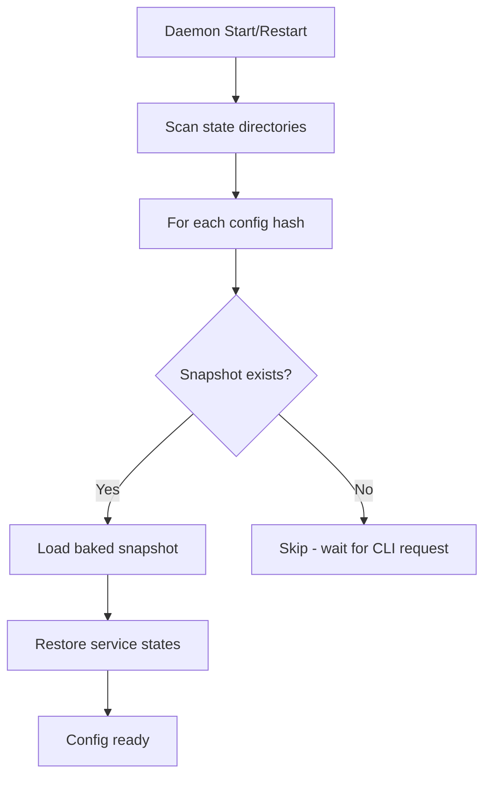
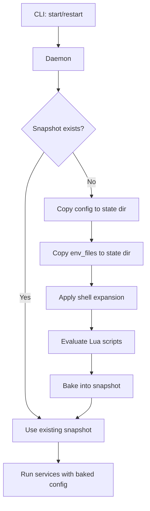
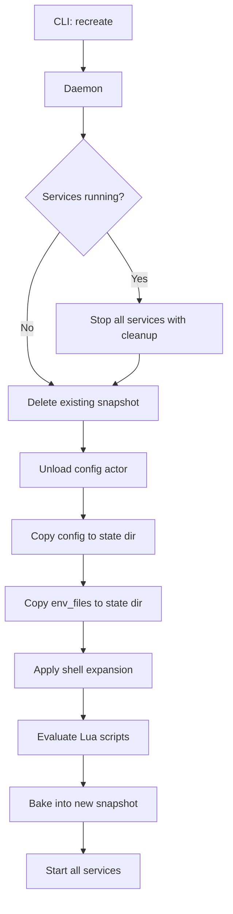
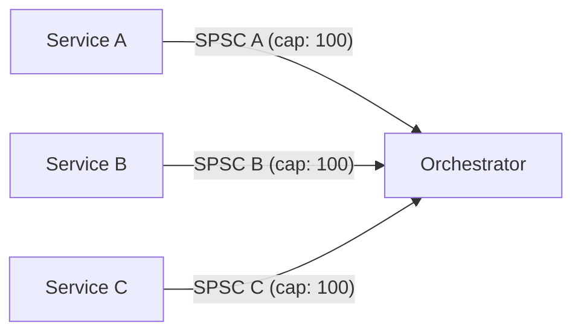
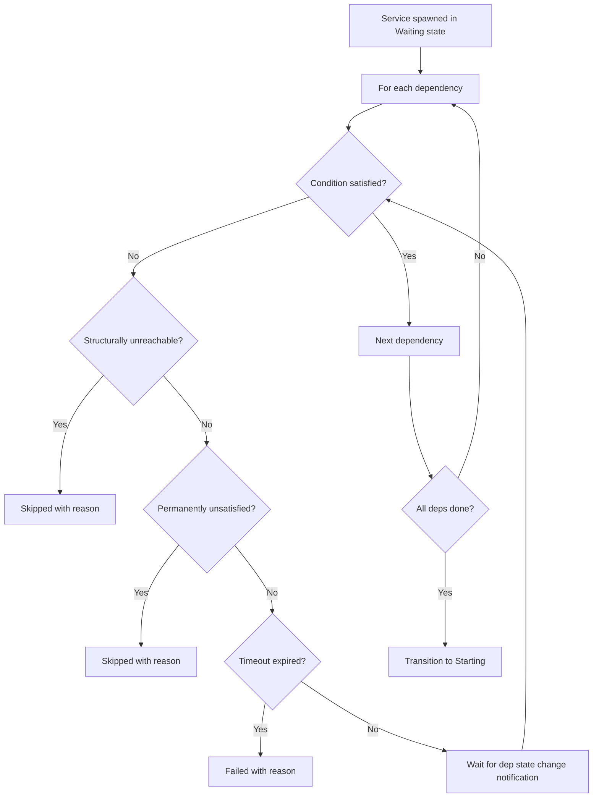
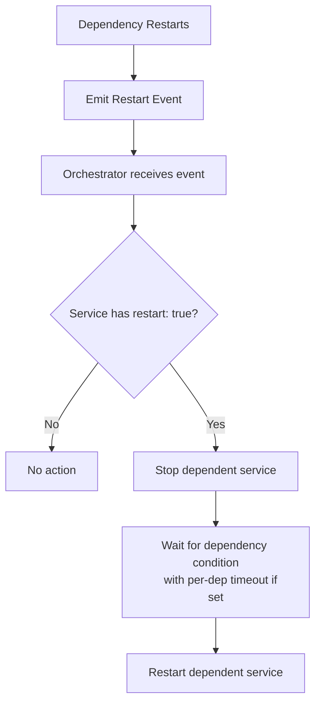
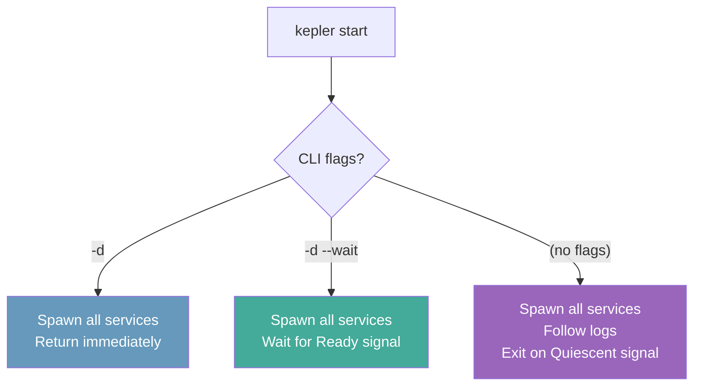
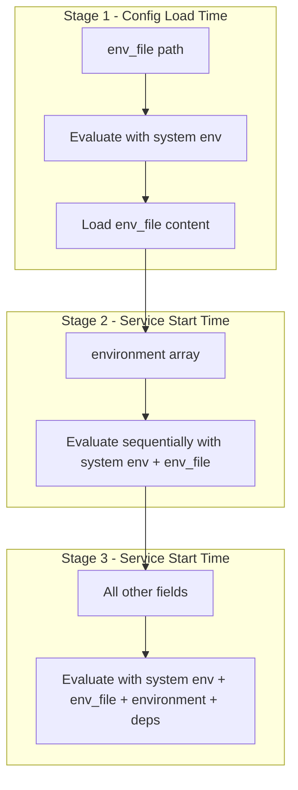
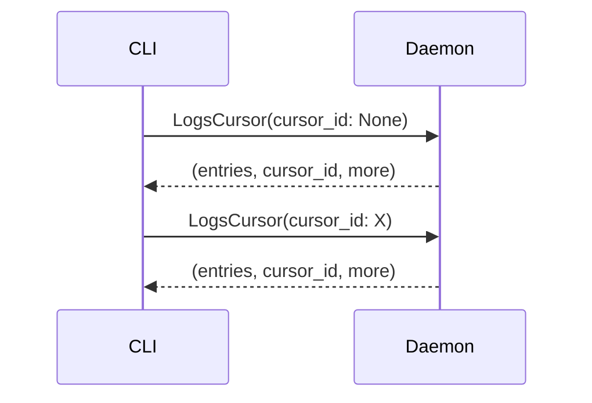

# Kepler Architecture

> For user-facing documentation, see the [documentation index](README.md).

This document describes Kepler's internal implementation, security measures, and design decisions. It is intended for contributors and developers who want to understand or modify the codebase.

## Table of Contents

- [Introduction](#introduction)
- [File Storage and Directory Structure](#file-storage-and-directory-structure)
- [Socket Security](#socket-security)
- [Configuration Lifecycle](#configuration-lifecycle)
- [Event-Driven Architecture](#event-driven-architecture)
- [Dependency Management](#dependency-management)
- [Environment Variable Handling](#environment-variable-handling)
- [Lua Scripting Security](#lua-scripting-security)
- [Process Security](#process-security)
- [Log Storage](#log-storage)

---

## Introduction

### Global Daemon Pattern

Kepler uses a single global daemon architecture. The daemon runs as root and manages all configurations and services:

- **Single socket**: `/var/lib/kepler/kepler.sock` handles all CLI communication
- **Group-based access**: CLI access is controlled via `kepler` group membership on the socket
- **Per-config isolation**: Each config gets its own state directory (hashed path)
- **Persistent state**: Daemon survives CLI disconnections, services continue running

For details on the security model, see [Security Model](security-model.md).

### Key Design Principles

1. **Security by default**: Root-only daemon, kepler group access control, environment isolation
2. **Configuration immutability**: Configs are "baked" on first service start
3. **Single evaluation**: Lua scripts and env vars expanded once, results persisted
4. **Graceful recovery**: State persisted to disk, restorable after daemon restart

---

## File Storage and Directory Structure

### Location

The daemon stores all state in `/var/lib/kepler/` (or `$KEPLER_DAEMON_PATH` if set):

```
/var/lib/kepler/
├── kepler.sock           # Unix domain socket (0o660 root:kepler)
├── kepler.pid            # Daemon PID file (0o660)
└── configs/              # Per-config state directories
    └── <config-hash>/
        ├── config.yaml         # Copied config (immutable after snapshot)
        ├── expanded_config.yaml  # Snapshot with resolved env vars
        ├── state.json          # Runtime service state
        ├── source_path.txt     # Original config location
        ├── env_files/          # Copied env files
        └── logs/               # Per-service log files
```

### Security

- **State directory**: `0o770` (root + kepler group access)
- **Socket**: `0o660 root:kepler` (root + kepler group access)
- **PID file**: `0o660` (root + kepler group access)
- **Daemon umask**: `0o007` ensures all created files/dirs are group-accessible
- **Purpose**: Root owns all state; kepler group members can access the CLI

See [Security Model](security-model.md) for the full access control design.

### Relevant Files

| File | Description |
|------|-------------|
| `kepler-daemon/src/lib.rs` | Directory structure constants and path helpers |
| `kepler-daemon/src/main.rs` | Root enforcement, umask, secure directory creation with `0o770` mode |
| `kepler-daemon/src/persistence.rs` | Secure file writing |

---

## Socket Security

### Kepler Group Access Control

The daemon uses Unix peer credentials to enforce group-based access:

1. Socket file permissions set to `0o660 root:kepler`
2. Each connection verified via `peer_cred()`
3. Root clients (UID 0) are always allowed
4. Other clients must be in the `kepler` group (checked via primary GID and supplementary groups via `getgrouplist()`)
5. Connections from users not in the kepler group are rejected

See [Security Model](security-model.md) for the full security design.

### Relevant Files

| File | Description |
|------|-------------|
| `kepler-protocol/src/server.rs` | Socket permissions, group resolution, and peer credential verification |

---

## Configuration Lifecycle

### Daemon Startup

When the daemon starts or restarts, it discovers and loads all previously known configs from their snapshots:



### CLI Config Request

When the CLI requests to start/restart a config:



See [Configuration](configuration.md) for the user-facing config reference, and [Variable Expansion](variable-expansion.md) / [Lua Scripting](lua-scripting.md) for details on the expansion stages.

### CLI Recreate Command

The `recreate` command performs a full stop, re-bake, and start cycle. It stops all running services with cleanup, discards the existing snapshot, re-bakes the config from source, and starts all services again.



Use `recreate` when:
- The original config file has changed
- Environment variables have changed
- env_files have been modified

### CLI PS Command

The `ps` command lists services and their states, including exit codes for stopped/failed services:

- `kepler ps` - Show services for the current config
- `kepler ps --all` - Show services across all loaded configs

Exit codes are displayed inline with the status (e.g., `Exited (0)`, `Exited (1)`, `Killed (SIGKILL)`).

See [CLI Reference](cli-reference.md) for all commands.

### CLI Prune Command

The `prune` command removes state directories for stopped or orphaned configs:

- `kepler prune` - Prune stopped/orphaned config state directories
- `kepler prune --force` - Force prune even if services appear running
- `kepler prune --dry-run` - Show what would be pruned without deleting

### Config Baking Process

When no snapshot exists (or after `recreate`), the config goes through a baking process:

1. **Copy files**: Config and env_files copied to state directory
2. **Shell expansion**: Environment variables expanded (see [Environment Variables](environment-variables.md))
3. **Lua evaluation**: `!lua` tags executed, return values substituted (see [Lua Scripting](lua-scripting.md))
4. **Snapshot creation**: Final expanded config saved as `expanded_config.yaml`

Once baked, the snapshot is immutable. Services always run using the baked snapshot, never the original config file.

### Relevant Files

| File | Description |
|------|-------------|
| `kepler-daemon/src/config_actor.rs` | Config initialization and snapshot management |
| `kepler-daemon/src/persistence.rs` | Snapshot persistence to disk |

---

## Event-Driven Architecture

Kepler uses an event-driven architecture for service lifecycle management. Each service emits events at various lifecycle stages, enabling features like restart propagation and health monitoring.

### Service Events

Services emit events at the following lifecycle points:

| Event | Description |
|-------|-------------|
| `Init` | First start of a service |
| `Start` | Before `pre_start` hook runs |
| `Restart` | Before service restarts (with reason) |
| `Exit` | When process exits (with exit code) |
| `Stop` | Before `pre_stop` hook runs |
| `Cleanup` | Before cleanup runs |
| `Healthcheck` | After each health check (with status) |
| `Healthy` | When service transitions to healthy |
| `Unhealthy` | When service transitions to unhealthy |

See [Service Lifecycle](service-lifecycle.md) for state transitions, and [Hooks](hooks.md) for lifecycle hooks.

### Restart Reasons

When a service restarts, the event includes the reason:

| Reason | Description |
|--------|-------------|
| `Watch` | File watcher triggered restart |
| `Failure` | Process exited with error (includes exit code) |
| `Manual` | User requested restart via CLI |
| `DependencyRestart` | Dependency restarted (includes dependency name) |

### Per-Service Event Channels

Each service has a dedicated SPSC (Single Producer, Single Consumer) event channel:



**Benefits:**
- **Isolation**: One misbehaving service can't flood others
- **Backpressure**: Per-service buffer quotas prevent noisy neighbor issues
- **Fairness**: Each service has guaranteed capacity for events

### Relevant Files

| File | Description |
|------|-------------|
| `kepler-daemon/src/events.rs` | ServiceEvent types, channel creation |
| `kepler-daemon/src/config_actor.rs` | Event channel management per service |
| `kepler-daemon/src/orchestrator.rs` | ServiceEventHandler, event processing |

---

## Dependency Management

Kepler supports Docker Compose-compatible dependency configuration with conditions, timeouts, and restart propagation.

For user-facing documentation, see [Dependencies](dependencies.md).

### Dependency Conditions

Services can specify conditions that must be met before starting:

| Condition | Description |
|-----------|-------------|
| `service_started` | Dependency status is Running, Healthy, or Unhealthy (default) |
| `service_healthy` | Dependency status is Healthy (requires healthcheck) |
| `service_completed_successfully` | Dependency exited with code 0 |
| `service_unhealthy` | Dependency was Healthy then became Unhealthy (requires healthcheck) |
| `service_failed` | Dependency failed: Exited with non-zero code, Killed by signal, or Failed (spawn error). Optional `exit_code` filter |
| `service_stopped` | Dependency is Stopped, Exited, Killed, or Failed. Optional `exit_code` filter |

### Spawn-All Architecture

All services are spawned at once. Each service independently waits for its dependencies via per-dependency notification channels (`watch_dep`). Services blocked on unmet dependencies are in the **Waiting** state.

The lifecycle for each spawned service:
1. **Waiting** — blocked on dependencies
2. **Starting** — dependencies satisfied, running hooks, spawning process
3. **Running** — process alive
4. **Healthy/Unhealthy** — if healthcheck configured

### Dependency Waiting

When a service starts, it waits for all dependencies to satisfy their conditions. Each dependency can have its own timeout via `depends_on.<dep>.timeout`. If no timeout is set, the wait is indefinite.



A dependency is **permanently unsatisfied** when the dependency is in a terminal state, its restart policy won't restart it, and the condition is not currently satisfied. The service is marked **Skipped**.

A dependency condition is **structurally unreachable** when the dependency's restart policy makes it impossible for the condition to ever be permanently met (e.g., `service_failed` with `restart: always`). The service is immediately marked **Skipped** once the dependency is running.

### Restart Propagation

When `restart: true` is set in a dependency configuration, the dependent service restarts when its dependency restarts:



### Two Daemon Signals: Ready and Quiescent

The daemon computes two signals for the CLI:

**Ready** (for `start -d --wait`): All services have reached their target state (Healthy if healthcheck, Running if not), are in a terminal state, or are in a deferred wait (Waiting with all unsatisfied deps in a stable state). Unhealthy counts as ready (healthcheck resolved).

**Quiescent** (for foreground mode): All services are settled — in a permanent terminal state or permanently blocked. Uses topological traversal to determine if any service could still transition.

Both signals are suppressed by a **startup fence** (`startup_in_progress` flag) that is raised before marking services as Waiting and lowered after all are marked, preventing premature signals during batch startup.

### Start Modes



| Flags | Behavior |
|-------|----------|
| `-d` | All services spawned in background. Returns immediately |
| `-d --wait` | All services spawned. CLI blocks until daemon sends **Ready** signal |
| (no flags) | All services spawned. CLI follows logs until daemon sends **Quiescent** signal. Ctrl+C sends stop |

### Configuration Format

```yaml
depends_on:
  service-a:
    condition: service_healthy
    timeout: 30s       # Per-dependency timeout (no global fallback)
    restart: true
  service-b:
    condition: service_started
    # No timeout — waits indefinitely
```

### Relevant Files

| File | Description |
|------|-------------|
| `kepler-daemon/src/config/mod.rs` | DependencyCondition, DependencyConfig, DependsOn types |
| `kepler-daemon/src/config/deps.rs` | DependencyConfig with timeout, restart, exit_code fields |
| `kepler-daemon/src/deps.rs` | Dependency graph, topological ordering, condition checking, permanently unsatisfied detection, structurally unreachable detection |
| `kepler-daemon/src/orchestrator/mod.rs` | Spawn-all startup, per-dep wait_for_dependencies, skip/fail handling |
| `kepler-daemon/src/orchestrator/events.rs` | Restart propagation with per-dep timeout |
| `kepler-daemon/src/config_actor/actor.rs` | Ready and Quiescent signal computation, per-dep notification watchers, startup fence |

---

## Environment Variable Handling

### Inline Lua Expression Syntax

Kepler uses `${{ expr }}$` inline Lua expressions for dynamic values in configuration:

| Syntax | Description |
|--------|-------------|
| `${{ env.VAR }}$` | Environment variable reference |
| `${{ env.VAR or "default" }}$` | Default value if unset |
| `${{ deps.svc.status }}$` | Dependency status |
| `${{ service.name }}$` | Current service name |

See [Inline Expressions](variable-expansion.md) for the user-facing reference.

### Three-Stage Expansion

Expression evaluation happens in three stages, each building on the previous context:



| Stage | What is evaluated | Evaluation context |
|-------|-------------------|-------------------|
| 1 | `env_file` path | System environment only (config load time) |
| 2 | `environment` array entries | System env + env_file variables (sequential, service start time) |
| 3 | All other fields (`command`, `working_dir`, `user`, hooks, etc.) | System env + env_file + environment + deps (service start time) |

See [Environment Variables](environment-variables.md) for the full reference.

### What is NOT Evaluated

`${{ }}$` expressions and `!lua` tags are intentionally **not** evaluated for service names in `depends_on` — service names must be literal strings for dependency graph construction. However, dependency config fields (`condition`, `timeout`, `restart`, `exit_code`) **do** support `!lua` and `${{ }}$`, evaluated eagerly at config load time.

### Environment Priority (Runtime)

When building the final process environment for a service (highest to lowest priority):

1. **Service `environment` array** (highest priority)
2. **Service `env_file` variables**
3. **System environment variables** (lowest priority)

Higher priority values override lower priority ones when keys conflict.

### Relevant Files

| File | Description |
|------|-------------|
| `kepler-daemon/src/config.rs` | Two-stage shell expansion logic |
| `kepler-daemon/src/env.rs` | Environment building and priority merging |

---

## Lua Scripting Security

### Luau Sandbox

Kepler uses the `mlua` crate with Luau for config templating. Luau is a sandboxed Lua 5.1 derivative designed for secure embedded scripting.

For user-facing documentation, see [Lua Scripting](lua-scripting.md).

### Sandboxed Standard Library

The Lua environment provides a **restricted subset** of the standard library:

| Available | NOT Available |
|-----------|---------------|
| `string` - String manipulation | `io` - File I/O operations |
| `math` - Mathematical functions | `os.execute` - Shell command execution |
| `table` - Table manipulation | `os.remove`, `os.rename` - File operations |
| `tonumber`, `tostring` | `loadfile`, `dofile` - Arbitrary file loading |
| `pairs`, `ipairs` | `debug` - Debug library |
| `type`, `select`, `unpack` | `package.loadlib` - Native library loading |
| `json` - JSON parse/stringify | |
| `yaml` - YAML parse/stringify | |

**No filesystem access**: Scripts cannot read, write, or modify files on disk.

**No command execution**: Scripts cannot spawn processes or execute shell commands.

**No network access**: Scripts cannot make network requests.

### Available Context

| Symbol | Description |
|--------|-------------|
| `env` | Shortcut: `hook.env` in hook context, else `service.env` |
| `service.env` | Read-only full environment (raw_env + env_file + environment) |
| `service.raw_env` | Read-only inherited base environment (from daemon/CLI) |
| `service.env_file` | Read-only env_file variables only |
| `service.name` | Current service name (nil if global) |
| `hook.name` | Current hook name (nil outside hooks) |
| `hook.env` | Read-only full hook environment (raw_env + env_file + environment) |
| `hook.raw_env` | Read-only inherited base environment (from parent service) |
| `hook.env_file` | Read-only hook env_file variables only |
| `global` | Mutable shared table for cross-block state |

### Security Measures

- **Environment tables frozen** via metatable proxy pattern
- **Writes to `service.*` / `hook.*` tables raise runtime errors**
- **Metatables protected** from removal
- **`require()` is blocked** to prevent loading external modules

### Single Evaluation

- Lua scripts evaluated **once** when config is first loaded
- Results "baked" into the configuration
- No runtime re-evaluation
- Global state persists across all evaluations in a single config load

### Execution Order

Lua scripts run in a specific order that mirrors shell expansion, with `env` progressively building up:

| Order | Block | `env` contains |
|-------|-------|---------------|
| 1 | `lua:` directive | System env only |
| 2 | `env_file: !lua` | System env only |
| 3 | `environment: !lua` | System env + env_file |
| 4 | All other `!lua` blocks | System env + env_file + environment array |

**Details:**

1. **`lua:` directive** runs first in global scope, defining functions available to all subsequent blocks. `env` contains only system environment variables.

2. **`env_file: !lua`** blocks run next (if any). `env` still contains only system environment, since env_file hasn't been loaded yet.

3. **`environment: !lua`** array blocks run after env_file is loaded. `env` now contains system env merged with env_file variables.

4. **All other `!lua` blocks** run in declaration order. `env` contains the full merged environment (system + env_file + environment array).

This ordering ensures that each stage has access to the variables it needs while maintaining deterministic evaluation.

### Relevant Files

| File | Description |
|------|-------------|
| `kepler-daemon/src/lua_eval.rs` | LuaEvaluator, frozen table pattern, sandbox setup |

---

## Process Security

### Root Requirement

The daemon must run as root. This is enforced unconditionally on startup — the daemon exits with an error if not running as root. Root is required to:

- Drop privileges per-service (setuid/setgid/initgroups to the configured `user`/`groups`)
- Create and chown the state directory and socket to `root:kepler`
- Set resource limits on spawned processes

For user-facing documentation, see [Privilege Dropping](privilege-dropping.md) and [Security Model](security-model.md).

### Privilege Dropping

Services can run as specific user/groups:

- User formats: `"username"`, `"1000"`, `"username:group"`, `"uid:gid"`
- By default, all supplementary groups are loaded via `initgroups()`; the `groups` field provides explicit lockdown
- Hooks inherit service user and groups by default (can override)
- The daemon drops privileges per-service at spawn time via `initgroups()`/`setgroups()` + `setgid()` + `setuid()`

### Environment Isolation

Services receive a controlled environment built from: (1) system environment, (2) env_file variables, (3) service-defined environment - with later sources overriding earlier ones.

See [Environment Variables](environment-variables.md) for the full reference.

### Resource Limits

Applied via `pre_exec` before process execution:

| Limit | Description |
|-------|-------------|
| `RLIMIT_AS` | Memory limits |
| `RLIMIT_CPU` | CPU time limits |
| `RLIMIT_NOFILE` | File descriptor limits |

### Relevant Files

| File | Description |
|------|-------------|
| `kepler-daemon/src/main.rs` | Root enforcement, umask, state directory setup |
| `kepler-daemon/src/process.rs` | Process spawning, privilege dropping, resource limits |
| `kepler-daemon/src/user.rs` | User/group resolution |

---

## Log Storage

### File Structure

Logs are stored in the config's state directory under `logs/`:

```
/var/lib/kepler/configs/<config-hash>/logs/
├── service-name.stdout.log    # Standard output
└── service-name.stderr.log    # Standard error
```

Each service has two log files: one for stdout and one for stderr. Log files are timestamped line-by-line with millisecond precision.

For user-facing documentation, see [Log Management](log-management.md).

### Log Size Management

By default, log files grow unbounded. When `max_size` is configured, Kepler uses truncation to manage disk usage:

- **Single file per stream**: One file per service/stream (`service.stdout.log`, `service.stderr.log`)
- **Optional truncation**: When a log file exceeds `max_size`, it is truncated from the beginning
- **Recent logs preserved**: Only the oldest logs are discarded when truncating
- **Predictable disk usage**: When `max_size` is set, disk usage per service is bounded

Settings can be configured globally under `kepler.logs` or per-service under `services.<name>.logs`. Per-service settings override global settings.

### Buffered Writing

Log writes are buffered for performance:

1. **Lock-free buffer**: Each writer uses a per-service buffer to batch writes
2. **Configurable size**: `buffer_size` controls how many bytes are buffered before flushing (default: 0, synchronous writes)
3. **Automatic flush**: Buffers are flushed on service stop or when full

Trade-offs:
- `buffer_size: 0` (default) - Synchronous writes, safest for crash recovery
- `buffer_size: 8192` - 8KB buffer, good balance of performance and safety
- `buffer_size: 16384` - 16KB buffer, ~30% better throughput

### Cursor-Based Streaming

Log retrieval uses server-side cursors for efficient streaming:



**Cursor features:**
- **Position tracking**: Each cursor tracks byte offsets per log file
- **Truncation detection**: Cursors detect when files are truncated and reset
- **TTL cleanup**: Stale cursors are automatically cleaned up (default: 5 minutes)
- **Chronological merging**: Logs from multiple services are merged by timestamp

**Modes:**
| Mode | CLI Flag | Behavior |
|------|----------|----------|
| head | `--head` | Return first N lines (one-shot) |
| tail | `--tail` | Return last N lines (one-shot) |
| all | (default) | Stream all existing logs, then exit |
| follow | `--follow` | Stream existing + new logs continuously |

### Relevant Files

| File | Description |
|------|-------------|
| `kepler-daemon/src/logs/writer.rs` | Buffered log writer with truncation |
| `kepler-daemon/src/logs/reader.rs` | Log file reader and merged iterators |
| `kepler-daemon/src/cursor.rs` | CursorManager for streaming |

---

## Key Files Reference

| Component | File | Description |
|-----------|------|-------------|
| Directory structure | `kepler-daemon/src/lib.rs` | State directory paths |
| Secure file writing | `kepler-daemon/src/persistence.rs` | File permissions |
| Socket security | `kepler-protocol/src/server.rs` | Group-based access control |
| Config loading | `kepler-daemon/src/config_actor.rs` | Lifecycle management, event channels |
| Env expansion | `kepler-daemon/src/config/expand.rs` | `${{ }}$` inline Lua expression evaluation |
| Env building | `kepler-daemon/src/env.rs` | Priority merging |
| Lua evaluation | `kepler-daemon/src/lua_eval.rs` | Sandbox implementation |
| Process spawning | `kepler-daemon/src/process.rs` | Security controls |
| Event system | `kepler-daemon/src/events.rs` | ServiceEvent types, event channels |
| Dependency graph | `kepler-daemon/src/deps.rs` | Start/stop ordering, condition checking |
| Service orchestration | `kepler-daemon/src/orchestrator.rs` | Event handling, restart propagation |
| Health checking | `kepler-daemon/src/health.rs` | Health check loop, event emission |
| Log writing | `kepler-daemon/src/logs/writer.rs` | Buffered log writer with truncation |
| Log reading | `kepler-daemon/src/logs/reader.rs` | Log file reader with merged iterators |
| Log cursors | `kepler-daemon/src/cursor.rs` | Server-side cursor management for streaming |

---

## See Also

- [Documentation Index](README.md) -- All documentation pages
- [Configuration](configuration.md) -- YAML config reference
- [Service Lifecycle](service-lifecycle.md) -- Status states and start modes
- [Dependencies](dependencies.md) -- Dependency conditions and ordering
- [Security Model](security-model.md) -- Root, kepler group, and auth
- [Protocol](protocol.md) -- Multiplexed IPC reference
