# Kepler Architecture

> For user-facing documentation, see the [documentation index](README.md).

This document describes Kepler's internal implementation, security measures, and design decisions. It is intended for contributors and developers who want to understand or modify the codebase.

## Table of Contents

- [Introduction](#introduction)
- [File Storage and Directory Structure](#file-storage-and-directory-structure)
- [Socket Security](#socket-security)
- [Configuration Lifecycle](#configuration-lifecycle)
- [Event-Driven Architecture](#event-driven-architecture)
- [Dependency Management](#dependency-management)
- [Environment Variable Handling](#environment-variable-handling)
- [Lua Scripting Security](#lua-scripting-security)
- [Process Security](#process-security)
- [Log Storage](#log-storage)
- [Resource Monitoring](#resource-monitoring)
- [Security Implementation Details](#security-implementation-details)

---

## Introduction

### Global Daemon Pattern

Kepler uses a single global daemon architecture. The daemon runs as root and manages all configurations and services:

- **Single socket**: `/var/lib/kepler/kepler.sock` (or `$KEPLER_SOCKET_PATH` if set) handles all CLI communication
- **Group-based access**: CLI access is controlled via `kepler` group membership on the socket
- **Per-config isolation**: Each config gets its own state directory (hashed path)
- **Persistent state**: Daemon survives CLI disconnections, services continue running

For details on the security model, see [Security Model](security-model.md).

### Key Design Principles

1. **Security by default**: Root-only daemon, kepler group access control, environment isolation
2. **Configuration immutability**: Configs are "baked" on first service start
3. **Single evaluation**: Lua scripts and env vars expanded once, results persisted
4. **Graceful recovery**: State persisted to disk, restorable after daemon restart

---

## File Storage and Directory Structure

### Location

The daemon stores all state in `/var/lib/kepler/` (or `$KEPLER_DAEMON_PATH` if set):

```
/var/lib/kepler/
├── kepler.sock           # Unix domain socket (0o666 root:kepler) — or at $KEPLER_SOCKET_PATH
├── kepler.pid            # Daemon PID file (0o660)
└── configs/              # Per-config state directories
    └── <config-hash>/
        ├── config.yaml         # Copied config (immutable after snapshot)
        ├── expanded_config.yaml  # Snapshot with resolved env vars
        ├── state.json          # Runtime service state
        ├── source_path.txt     # Original config location
        ├── env_files/          # Copied env files
        ├── logs/               # Per-service log files
        └── monitor.db          # Resource metrics (if monitoring enabled)
```

### Security

- **State directory**: `0o771` (root + kepler group access, world-traverse for token auth)
- **Socket**: `0o666 root:kepler` (world-accessible, auth handled at protocol level)
- **PID file**: `0o660` (root + kepler group access)
- **Daemon umask**: `0o007` ensures all created files/dirs are group-accessible
- **Purpose**: Root owns all state; kepler group members can access the CLI

See [Security Model](security-model.md) for the full access control design.

### Relevant Files

| File | Description |
|------|-------------|
| `kepler-daemon/src/lib.rs` | Directory structure constants and path helpers |
| `kepler-daemon/src/main.rs` | Root enforcement, umask, secure directory creation with `0o771` mode |
| `kepler-daemon/src/persistence.rs` | Secure file writing |

---

## Socket Security

### Kepler Group Access Control

The daemon uses Unix peer credentials to enforce group-based access:

1. Socket file permissions set to `0o666 root:kepler`
2. Each connection verified via `peer_cred()`
3. Root clients (UID 0) are always allowed
4. Other clients must be in the `kepler` group (checked via primary GID and supplementary groups via `getgrouplist()`)
5. Connections from users not in the kepler group are rejected

See [Security Model](security-model.md) for the full security design.

### Relevant Files

| File | Description |
|------|-------------|
| `kepler-protocol/src/server.rs` | Socket permissions, group resolution, and peer credential verification |

---

## Configuration Lifecycle

### Daemon Startup

When the daemon starts or restarts, it discovers and loads all previously known configs from their snapshots:

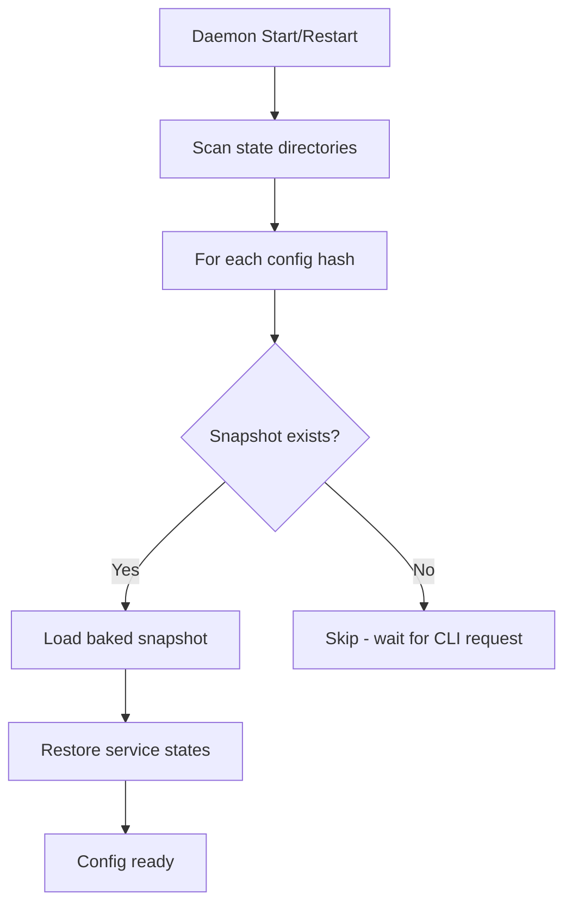
```mermaid
flowchart TD
    A[Daemon Start/Restart] --> B[Scan state directories]
    B --> C[For each config hash]
    C --> D{Snapshot exists?}
    D -->|Yes| E[Load baked snapshot]
    D -->|No| F[Skip - wait for CLI request]
    E --> G[Restore service states]
    G --> H[Config ready]
```

### CLI Config Request

When the CLI requests to start/restart a config:

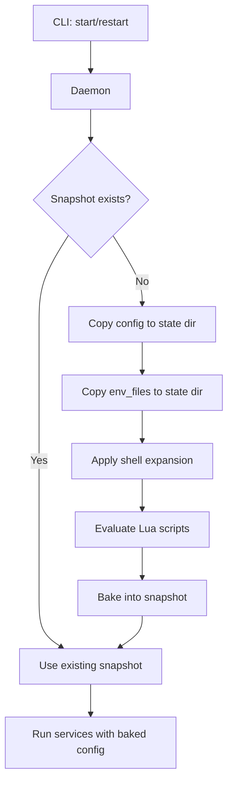
```mermaid
flowchart TD
    A[CLI: start/restart] --> B[Daemon]
    B --> C{Snapshot exists?}
    C -->|Yes| D[Use existing snapshot]
    C -->|No| E[Copy config to state dir]
    E --> F[Copy env_files to state dir]
    F --> G[Apply shell expansion]
    G --> H[Evaluate Lua scripts]
    H --> I[Bake into snapshot]
    I --> D
    D --> J[Run services with baked config]
```

See [Configuration](configuration.md) for the user-facing config reference, and [Variable Expansion](variable-expansion.md) / [Lua Scripting](lua-scripting.md) for details on the expansion stages.

### CLI Recreate Command

The `recreate` command performs a full stop, re-bake, and start cycle. It stops all running services with cleanup, discards the existing snapshot, re-bakes the config from source, and starts all services again.

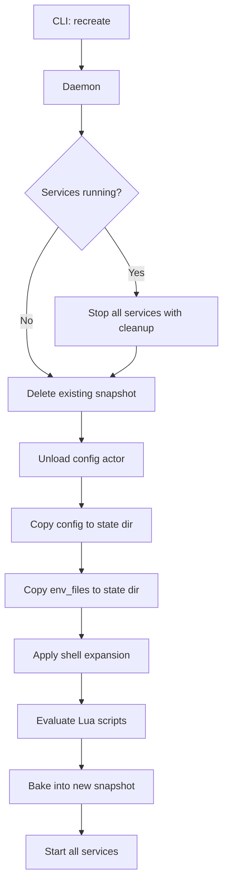
```mermaid
flowchart TD
    A[CLI: recreate] --> B[Daemon]
    B --> C{Services running?}
    C -->|Yes| D[Stop all services with cleanup]
    C -->|No| E[Delete existing snapshot]
    D --> E
    E --> F[Unload config actor]
    F --> G[Copy config to state dir]
    G --> H[Copy env_files to state dir]
    H --> I[Apply shell expansion]
    I --> J[Evaluate Lua scripts]
    J --> K[Bake into new snapshot]
    K --> L[Start all services]
```

Use `recreate` when:
- The original config file has changed
- Environment variables have changed
- env_files have been modified

### CLI PS Command

The `ps` command lists services and their states, including exit codes for stopped/failed services:

- `kepler ps` - Show services for the current config
- `kepler ps --all` - Show services across all loaded configs
- `kepler ps --json` - Output as JSON instead of a table

Exit codes are displayed inline with the status (e.g., `Exited (0)`, `Exited (1)`, `Killed (SIGKILL)`).

See [CLI Reference](cli-reference.md) for all commands.

### CLI Prune Command

The `prune` command removes state directories for stopped or orphaned configs:

- `kepler prune` - Prune stopped/orphaned config state directories
- `kepler prune --force` - Force prune even if services appear running
- `kepler prune --dry-run` - Show what would be pruned without deleting

### Config Baking Process

When no snapshot exists (or after `recreate`), the config goes through a baking process:

1. **Copy files**: Config and env_files copied to state directory
2. **Shell expansion**: Environment variables expanded (see [Environment Variables](environment-variables.md))
3. **Lua evaluation**: `!lua` tags executed, return values substituted (see [Lua Scripting](lua-scripting.md))
4. **Snapshot creation**: Final expanded config saved as `expanded_config.yaml`

Once baked, the snapshot is immutable. Services always run using the baked snapshot, never the original config file.

### Relevant Files

| File | Description |
|------|-------------|
| `kepler-daemon/src/config_actor/` | Config initialization and snapshot management |
| `kepler-daemon/src/persistence.rs` | Snapshot persistence to disk |

---

## Event-Driven Architecture

Kepler uses an event-driven architecture for service lifecycle management. Each service emits events at various lifecycle stages, enabling features like restart propagation and health monitoring.

### Service Events

Services emit events at the following lifecycle points:

| Event | Description |
|-------|-------------|
| `Init` | First start of a service |
| `Start` | Before `pre_start` hook runs |
| `Restart` | Before service restarts (with reason) |
| `Exit` | When process exits (with exit code) |
| `Stop` | Before `pre_stop` hook runs |
| `Cleanup` | Before cleanup runs |
| `Healthcheck` | After each health check (with status) |
| `Healthy` | When service transitions to healthy |
| `Unhealthy` | When service transitions to unhealthy |

See [Service Lifecycle](service-lifecycle.md) for state transitions, and [Hooks](hooks.md) for lifecycle hooks.

### Restart Reasons

When a service restarts, the event includes the reason:

| Reason | Description |
|--------|-------------|
| `Watch` | File watcher triggered restart |
| `Failure` | Process exited with error (includes exit code) |
| `Manual` | User requested restart via CLI |
| `DependencyRestart` | Dependency restarted (includes dependency name) |

### Per-Service Event Channels

Each service has a dedicated SPSC (Single Producer, Single Consumer) event channel:

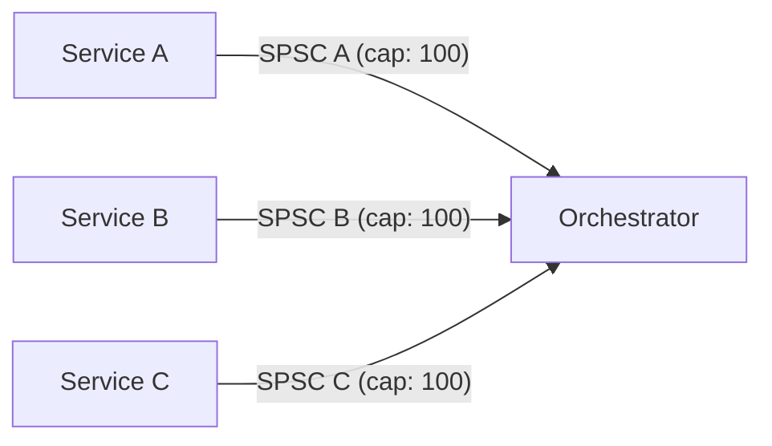
```mermaid
flowchart LR
    A[Service A] -- "SPSC A (cap: 100)" --> O[Orchestrator]
    B[Service B] -- "SPSC B (cap: 100)" --> O
    C[Service C] -- "SPSC C (cap: 100)" --> O
```

**Benefits:**
- **Isolation**: One misbehaving service can't flood others
- **Backpressure**: Per-service buffer quotas prevent noisy neighbor issues
- **Fairness**: Each service has guaranteed capacity for events

### Relevant Files

| File | Description |
|------|-------------|
| `kepler-daemon/src/events.rs` | ServiceEvent types, channel creation |
| `kepler-daemon/src/config_actor/` | Event channel management per service |
| `kepler-daemon/src/orchestrator/` | ServiceEventHandler, event processing |

---

## Dependency Management

Kepler supports Docker Compose-compatible dependency configuration with conditions, timeouts, and restart propagation.

For user-facing documentation, see [Dependencies](dependencies.md).

### Dependency Conditions

Services can specify conditions that must be met before starting:

| Condition | Description |
|-----------|-------------|
| `service_started` | Dependency status is Running, Healthy, or Unhealthy (default) |
| `service_healthy` | Dependency status is Healthy (requires healthcheck) |
| `service_completed_successfully` | Dependency exited with code 0 |
| `service_unhealthy` | Dependency was Healthy then became Unhealthy (requires healthcheck) |
| `service_failed` | Dependency failed: Exited with non-zero code, Killed by signal, or Failed (spawn error). Optional `exit_code` filter |
| `service_stopped` | Dependency is Stopped, Exited, Killed, or Failed. Optional `exit_code` filter |

### Spawn-All Architecture

All services are spawned at once. Each service independently waits for its dependencies via per-dependency notification channels (`watch_dep`). Services blocked on unmet dependencies are in the **Waiting** state.

The lifecycle for each spawned service:
1. **Waiting** — blocked on dependencies
2. **Starting** — dependencies satisfied, running hooks, spawning process
3. **Running** — process alive
4. **Healthy/Unhealthy** — if healthcheck configured

### Dependency Waiting

When a service starts, it waits for all dependencies to satisfy their conditions. Each dependency can have its own timeout via `depends_on.<dep>.timeout`. If no timeout is set, the wait is indefinite.

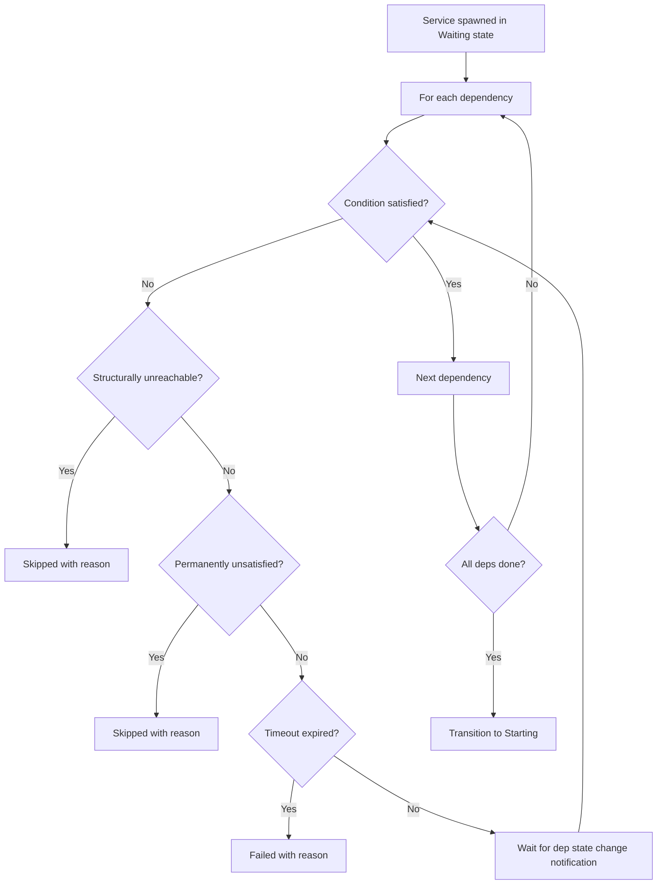
```mermaid
flowchart TD
    A[Service spawned in Waiting state] --> B[For each dependency]
    B --> C{Condition satisfied?}
    C -->|Yes| B2[Next dependency]
    C -->|No| D{Structurally unreachable?}
    D -->|Yes| Skip[Skipped with reason]
    D -->|No| E{Permanently unsatisfied?}
    E -->|Yes| Skip2[Skipped with reason]
    E -->|No| F{Timeout expired?}
    F -->|Yes| Fail[Failed with reason]
    F -->|No| G[Wait for dep state change notification]
    G --> C
    B2 --> H{All deps done?}
    H -->|No| B
    H -->|Yes| I[Transition to Starting]
```

A dependency is **permanently unsatisfied** when the dependency is in a terminal state, its restart policy won't restart it, and the condition is not currently satisfied. The service is marked **Skipped**.

A dependency condition is **structurally unreachable** when the dependency's restart policy makes it impossible for the condition to ever be permanently met (e.g., `service_failed` with `restart: always`). The service is immediately marked **Skipped** once the dependency is running.

### Restart Propagation

When `restart: true` is set in a dependency configuration, the dependent service restarts when its dependency restarts:

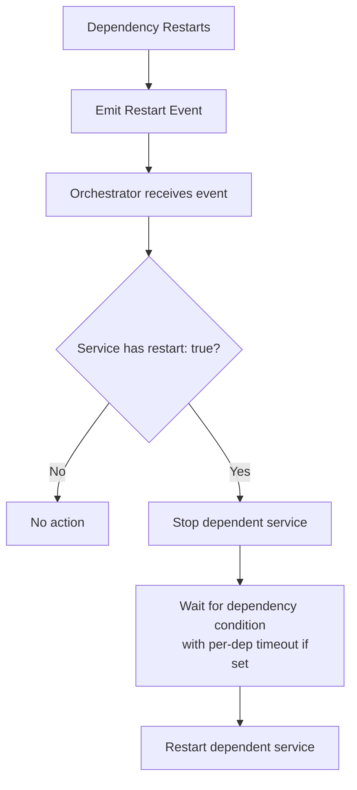
```mermaid
flowchart TD
    A[Dependency Restarts] --> B[Emit Restart Event]
    B --> C[Orchestrator receives event]
    C --> D{Service has restart: true?}
    D -->|No| E[No action]
    D -->|Yes| F[Stop dependent service]
    F --> G[Wait for dependency condition
    with per-dep timeout if set]
    G --> H[Restart dependent service]
```

### Two Daemon Signals: Ready and Quiescent

The daemon computes two signals for the CLI:

**Ready** (for `start -d --wait`): All services have reached their target state (Healthy if healthcheck, Running if not), are in a terminal state, or are in a deferred wait (Waiting with all unsatisfied deps in a stable state). Unhealthy counts as ready (healthcheck resolved).

**Quiescent** (for foreground mode): All services are settled — in a permanent terminal state or permanently blocked. Uses topological traversal to determine if any service could still transition.

Both signals are suppressed by a **startup fence** (`startup_in_progress` flag) that is raised before marking services as Waiting and lowered after all are marked, preventing premature signals during batch startup.

### Start Modes

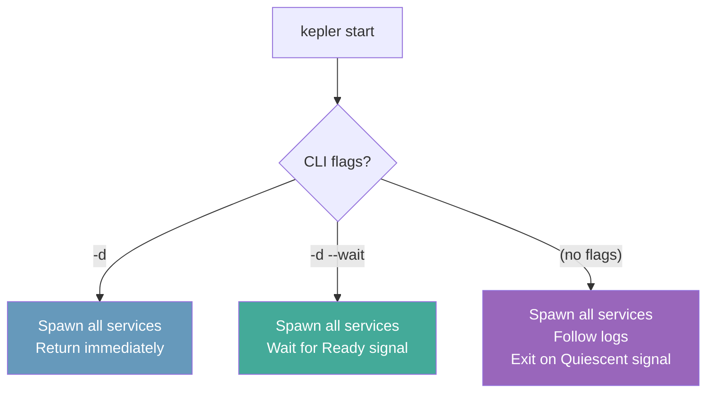
```mermaid
flowchart TD
    Start["kepler start"] --> Mode{"CLI flags?"}
    Mode -->|"-d"| Detached["Spawn all services
    Return immediately"]
    Mode -->|"-d --wait"| Wait["Spawn all services
    Wait for Ready signal"]
    Mode -->|"(no flags)"| FG["Spawn all services
    Follow logs
    Exit on Quiescent signal"]

    style Detached fill:#69b,color:#fff
    style Wait fill:#4a9,color:#fff
    style FG fill:#96b,color:#fff
```

| Flags | Behavior |
|-------|----------|
| `-d` | All services spawned in background. Returns immediately |
| `-d --wait` | All services spawned. CLI blocks until daemon sends **Ready** signal |
| (no flags) | All services spawned. CLI follows logs until daemon sends **Quiescent** signal. Ctrl+C sends stop |

### Configuration Format

```yaml
depends_on:
  service-a:
    condition: service_healthy
    timeout: 30s       # Per-dependency timeout (no global fallback)
    restart: true
  service-b:
    condition: service_started
    # No timeout — waits indefinitely
```

### Relevant Files

| File | Description |
|------|-------------|
| `kepler-daemon/src/config/mod.rs` | DependencyCondition, DependencyConfig, DependsOn types |
| `kepler-daemon/src/config/deps.rs` | DependencyConfig with timeout, restart, exit_code fields |
| `kepler-daemon/src/deps.rs` | Dependency graph, topological ordering, condition checking, permanently unsatisfied detection, structurally unreachable detection |
| `kepler-daemon/src/orchestrator/mod.rs` | Spawn-all startup, per-dep wait_for_dependencies, skip/fail handling |
| `kepler-daemon/src/orchestrator/events.rs` | Restart propagation with per-dep timeout |
| `kepler-daemon/src/config_actor/actor.rs` | Ready and Quiescent signal computation, per-dep notification watchers, startup fence |

---

## Environment Variable Handling

### Inline Lua Expression Syntax

Kepler uses `${{ expr }}$` inline Lua expressions for dynamic values in configuration:

| Syntax | Description |
|--------|-------------|
| `${{ service.env.VAR }}$` | Service environment variable reference |
| `${{ service.env.VAR or "default" }}$` | Default value if unset |
| `${{ deps.svc.status }}$` | Dependency status |
| `${{ service.name }}$` | Current service name |

See [Inline Expressions](variable-expansion.md) for the user-facing reference.

### Three-Stage Expansion

Expression evaluation happens in three stages, each building on the previous context:

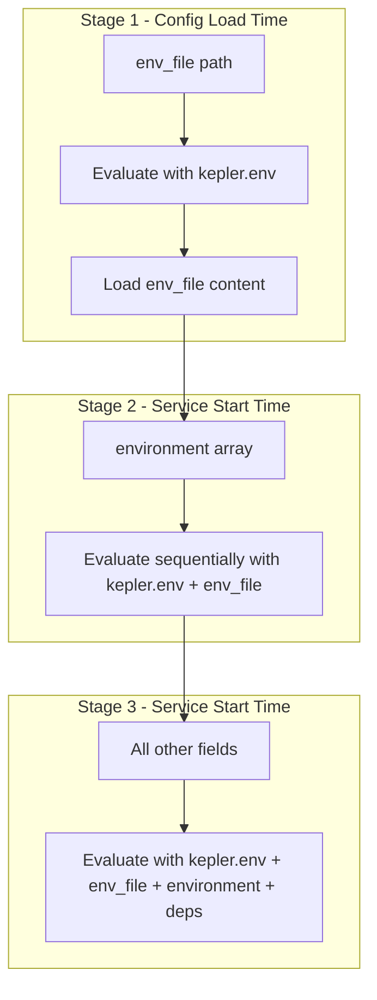
```mermaid
flowchart TD
    subgraph Stage1[Stage 1 - Config Load Time]
        A[env_file path] --> B[Evaluate with kepler.env]
        B --> C[Load env_file content]
    end
    subgraph Stage2[Stage 2 - Service Start Time]
        C --> D[environment array]
        D --> E[Evaluate sequentially with kepler.env + env_file]
    end
    subgraph Stage3[Stage 3 - Service Start Time]
        E --> F[All other fields]
        F --> G[Evaluate with kepler.env + env_file + environment + deps]
    end
```

| Stage | What is evaluated | Evaluation context |
|-------|-------------------|-------------------|
| 1 | `env_file` path | `kepler.env` only (config load time) |
| 2 | `environment` array entries | `kepler.env` + env_file variables (sequential, service start time) |
| 3 | All other fields (`command`, `working_dir`, `user`, hooks, etc.) | `kepler.env` + env_file + environment + deps (service start time) |

See [Environment Variables](environment-variables.md) for the full reference.

### What is NOT Evaluated

`${{ }}$` expressions and `!lua` tags are intentionally **not** evaluated for service names in `depends_on` — service names must be literal strings for dependency graph construction. However, dependency config fields (`condition`, `timeout`, `restart`, `exit_code`) **do** support `!lua` and `${{ }}$`, evaluated eagerly at config load time.

### Environment Priority (Runtime)

When building the final process environment for a service (highest to lowest priority):

1. **Service `environment` array** (highest priority)
2. **Service `env_file` variables**
3. **Kepler environment** (`kepler.env`) (lowest priority, only if `inherit_env: true`)

Higher priority values override lower priority ones when keys conflict.

### Relevant Files

| File | Description |
|------|-------------|
| `kepler-daemon/src/config/expand.rs` | Two-stage shell expansion logic |
| `kepler-daemon/src/env.rs` | Environment building and priority merging |

---

## Lua Scripting Security

### Luau Sandbox

Kepler uses the `mlua` crate with Luau for config templating. Luau is a sandboxed Lua 5.1 derivative designed for secure embedded scripting.

For user-facing documentation, see [Lua Scripting](lua-scripting.md).

### Sandboxed Standard Library

The Lua environment provides a **restricted subset** of the standard library:

| Available | NOT Available |
|-----------|---------------|
| `string` - String manipulation | `io` - File I/O operations |
| `math` - Mathematical functions | `os.execute` - Shell command execution |
| `table` - Table manipulation | `os.remove`, `os.rename` - File operations |
| `tonumber`, `tostring` | `loadfile`, `dofile` - Arbitrary file loading |
| `pairs`, `ipairs` | `debug` - Debug library |
| `type`, `select`, `unpack` | `package.loadlib` - Native library loading |
| `json` - JSON parse/stringify | |
| `yaml` - YAML parse/stringify | |

**No filesystem access**: Scripts cannot read, write, or modify files on disk.

**No command execution**: Scripts cannot spawn processes or execute shell commands.

**No network access**: Scripts cannot make network requests.

### Available Context

| Symbol | Description |
|--------|-------------|
| `kepler.env` | Read-only kepler environment (declared via `autostart.environment`, or full CLI env when autostart is disabled) |
| `service.env` | Read-only full environment (raw_env + env_file + environment) |
| `service.raw_env` | Read-only inherited base environment (from daemon/CLI) |
| `service.env_file` | Read-only env_file variables only |
| `service.name` | Current service name (nil if global) |
| `hook.name` | Current hook name (nil outside hooks) |
| `hook.env` | Read-only full hook environment (raw_env + env_file + environment) |
| `hook.raw_env` | Read-only inherited base environment (from parent service) |
| `hook.env_file` | Read-only hook env_file variables only |
| `global` | Mutable shared table for cross-block state |

### Security Measures

- **Environment tables frozen** via metatable proxy pattern
- **Writes to `service.*` / `hook.*` tables raise runtime errors**
- **Metatables protected** from removal
- **`require()` is blocked** to prevent loading external modules

### Evaluation Model

- **Global config** (`kepler:` namespace, `lua:` directive): evaluated **once** at config load time
- **Service config** (`${{ }}$`, `!lua`): re-evaluated **on every service start/restart** with the current runtime context (deps, restart_count, etc.)
- Global state persists across all evaluations in a single evaluation pass

### Execution Order

Lua scripts run in a specific order that mirrors shell expansion, with `service.env` progressively building up:

| Order | Block | Available context |
|-------|-------|-------------------|
| 1 | `lua:` directive | `kepler.env` only |
| 2 | `env_file: !lua` | `kepler.env` + `service.raw_env` |
| 3 | `environment: !lua` | `kepler.env` + `service.raw_env` + `service.env_file` + `service.env` (sequential) |
| 4 | All other `!lua` blocks | `kepler.env` + `service.raw_env` + `service.env_file` + `service.env` + `deps` |

**Details:**

1. **`lua:` directive** runs first in global scope, defining functions available to all subsequent blocks. Only `kepler.env` is available (the kepler environment).

2. **`env_file: !lua`** blocks run next (if any). `kepler.env` and `service.raw_env` are available, but env_file hasn't been loaded yet.

3. **`environment: !lua`** array blocks run after env_file is loaded. `service.env` now progressively builds up with each resolved entry.

4. **All other `!lua` blocks** run in declaration order. `service.env` contains the full merged environment (raw_env + env_file + environment array), and `deps` is available.

This ordering ensures that each stage has access to the variables it needs while maintaining deterministic evaluation.

### Relevant Files

| File | Description |
|------|-------------|
| `kepler-daemon/src/lua/` | LuaEvaluator, frozen table pattern, sandbox setup, ACL runtime |

---

## Process Security

### Root Requirement

The daemon must run as root. This is enforced unconditionally on startup — the daemon exits with an error if not running as root. Root is required to:

- Drop privileges per-service (setuid/setgid/initgroups to the configured `user`/`groups`)
- Create and chown the state directory and socket to `root:kepler`
- Set resource limits on spawned processes

For user-facing documentation, see [Privilege Dropping](privilege-dropping.md) and [Security Model](security-model.md).

### Privilege Dropping

Services can run as specific user/groups:

- User formats: `"username"`, `"1000"`, `"username:group"`, `"uid:gid"`
- By default, all supplementary groups are loaded via `initgroups()`; the `groups` field provides explicit lockdown
- Hooks inherit service user and groups by default (can override)
- The daemon drops privileges per-service at spawn time via `initgroups()`/`setgroups()` + `setgid()` + `setuid()`

### Environment Isolation

Services receive a controlled environment built from: (1) kepler environment (`kepler.env`, if `inherit_env: true`), (2) env_file variables, (3) service-defined environment — with later sources overriding earlier ones.

See [Environment Variables](environment-variables.md) for the full reference.

### Resource Limits

Applied via `pre_exec` before process execution:

| Limit | Description |
|-------|-------------|
| `RLIMIT_AS` | Memory limits |
| `RLIMIT_CPU` | CPU time limits |
| `RLIMIT_NOFILE` | File descriptor limits |

### Relevant Files

| File | Description |
|------|-------------|
| `kepler-daemon/src/main.rs` | Root enforcement, umask, state directory setup |
| `kepler-daemon/src/process/` | Process spawning, privilege dropping, resource limits |
| `kepler-daemon/src/user.rs` | User/group resolution |

---

## Log Storage

### SQLite-Backed Architecture

Logs are stored in a single SQLite database per config:

```
/var/lib/kepler/configs/<config-hash>/logs/logs.db
```

All services share a single database with a `logs` table containing service name, log level (out/err), timestamp, line content, hook name, and JSON detection flag. The monotonically increasing rowid serves as the cursor position for streaming.

For user-facing documentation, see [Log Management](log-management.md).

### Single-Writer Architecture

The log system uses a dedicated writer thread per config (the `LogStoreActor`):

1. **LogStoreHandle** (cloneable) — sends commands via `std::sync::mpsc` channel
2. **LogWriter** — thin per-service wrapper that sends `InsertEntry` commands to the store
3. **LogStoreActor** — dedicated `std::thread` that owns the SQLite write connection, batches inserts, and flushes on a configurable interval

Write path:
- Service stdout/stderr → `LogWriter::write()` → `LogStoreHandle::send()` → mpsc channel → `LogStoreActor` batches → SQLite transaction

The actor batches up to 4096 entries and flushes them in a single transaction when the `flush_interval` elapses or the batch is full.

### Storage Modes

| Mode | Journal | Synchronous | Use Case |
|------|---------|-------------|----------|
| **Local** (default) | WAL | NORMAL | Local filesystem — concurrent readers, high throughput |
| **NFS** | DELETE | FULL | Network filesystem — correctness over performance |

Additional pragmas: `mmap_size=0` (disabled), `cache_size=-8000` (8MB), `temp_store=MEMORY`.

### Read Path

Log reads use fresh read-only connections opened per query (required for NFS correctness, cheap on local WAL). The `SqliteLogReader` provides:
- `tail(count)` — last N entries
- `head(count)` — first N entries
- `after(id, limit, filter?)` — cursor-based pagination with optional SQL WHERE filter

All read methods support optional service name filter and `no_hooks` filter (excludes hook logs by service name pattern).

### Filter Security (Authorizer-Based)

When a user provides a filter expression, the raw SQL WHERE fragment is injected directly into the query. Safety is enforced by SQLite's authorizer API combined with resource limits and a progress handler timeout — **not** by parsing a custom DSL.

This design was chosen over a custom filter parser because it:
- Supports JSON queries (`json_extract`), full-text search, and timestamp ranges without parser maintenance
- Leverages SQLite's own compile-time validation via the authorizer callback
- Cannot be bypassed by SQL syntax tricks (the authorizer sees the parsed AST, not raw text)

**Defense layers applied to filter connections:**

1. **Read-only connection** — `SQLITE_OPEN_READONLY`, cannot modify data
2. **Authorizer** — deny-by-default callback set before `prepare()`. Allows only SELECT on `logs`, column reads on `logs`, and whitelisted functions. Denies writes, DDL, ATTACH, PRAGMA, reads on other tables, and non-whitelisted functions
3. **Resource limits** — expression depth (20), LIKE pattern length (100), SQL length (10K), compound SELECT (2), function args (8), attached databases (0)
4. **Progress handler** — aborts queries exceeding 5 seconds

See [Security Model — Log Query Security](security-model.md#log-query-security) for the full security design, allowed functions, and known attack vectors.

### Streaming

Log retrieval uses rowid-based pagination via the `LogsStream` protocol request. The client tracks its position by passing back `last_id` from the previous response as `after_id` in the next request.

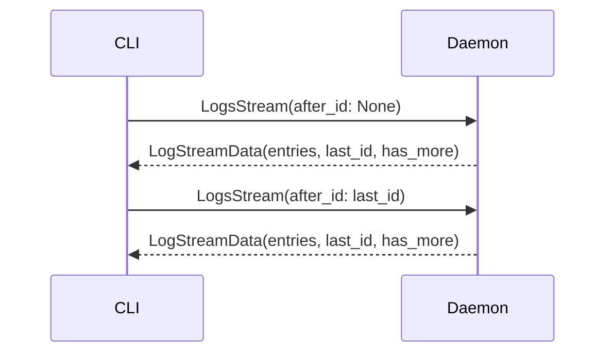
```mermaid
sequenceDiagram
    CLI->>Daemon: LogsStream(after_id: None)
    Daemon-->>CLI: LogStreamData(entries, last_id, has_more)
    CLI->>Daemon: LogsStream(after_id: last_id)
    Daemon-->>CLI: LogStreamData(entries, last_id, has_more)
```

For follow mode, the client subscribes to `SubscribeLogs` notifications and issues `LogsStream` requests after each `LogsAvailable` event.

**Modes:**
| Mode | CLI Flag | Behavior |
|------|----------|----------|
| head | `--head` | Return first N lines (one-shot) |
| tail | `--tail` | Return last N lines (one-shot) |
| all | (default) | Stream all existing logs, then exit |
| follow | `--follow` | Stream existing + new logs continuously |

### Relevant Files

| File | Description |
|------|-------------|
| `kepler-daemon/src/logs/store.rs` | LogStoreActor (writer thread) and LogStoreHandle |
| `kepler-daemon/src/logs/log_writer.rs` | Per-service LogWriter (thin wrapper) |
| `kepler-daemon/src/logs/log_reader.rs` | SqliteLogReader (read-only queries, filter injection) |
| `kepler-daemon/src/logs/filter.rs` | Filter validation, SQLite authorizer setup, resource limits |

---

## Resource Monitoring

Kepler includes an optional resource monitoring subsystem that periodically samples CPU and memory usage for running services.

### Architecture

When `kepler.monitor` is configured, the monitor is spawned per config on the first service start. It consists of two components running in parallel: an async **collector** task and a dedicated **writer** thread, connected by an mpsc channel. This mirrors the log store's actor pattern.

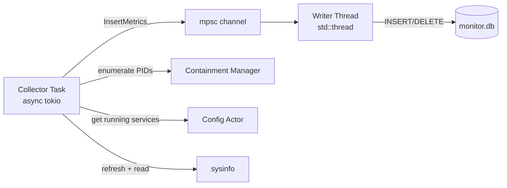
```mermaid
flowchart LR
    C[Collector Task<br/>async tokio] -->|"InsertMetrics"| CH[mpsc channel]
    CH --> W[Writer Thread<br/>std::thread]
    W -->|"INSERT/DELETE"| DB[(monitor.db)]
    C -->|"enumerate PIDs"| CM[Containment Manager]
    C -->|"get running services"| A[Config Actor]
    C -->|"refresh + read"| S[sysinfo]
```

The **collector** periodically samples CPU/memory metrics via sysinfo/cgroups and sends `InsertMetrics` commands through the channel. The **writer** owns the SQLite write connection, inserts metrics, and runs time-budgeted retention cleanup. Read-only queries open separate connections.

### Metric Collection

For each running service, the collector:

1. **Enumerates PIDs** — Uses cgroup v2 (if available) to get all PIDs in the service's cgroup, or falls back to the main PID + sysinfo process tree walking
2. **Refreshes process info** — Calls `sysinfo` to get current CPU and memory stats for the enumerated PIDs
3. **Aggregates** — Sums CPU percentage, RSS memory, and virtual memory across the entire process tree
4. **Sends** — Sends all service metrics to the writer thread through the channel

### Storage

Metrics are stored in `<state_dir>/monitor.db` using SQLite (WAL mode on local filesystems, DELETE journal on NFS). The schema:

| Column | Type | Description |
|--------|------|-------------|
| `timestamp` | `INTEGER` | Unix epoch milliseconds |
| `service` | `TEXT` | Service name |
| `cpu_percent` | `REAL` | Total CPU usage across process tree |
| `memory_rss` | `INTEGER` | Total RSS memory in bytes |
| `memory_vss` | `INTEGER` | Total virtual memory in bytes |
| `pids` | `TEXT` | JSON array of PIDs (e.g., `[1234,1235]`) |

Indexes on `timestamp` and `(service, timestamp)` enable efficient range queries.

### Retention

- **No `retention_period`** (default): Metrics persist indefinitely (same as logs)
- **With `retention_period`**: Expired rows are cleaned up using time-budgeted batched deletes

When retention is configured, cleanup runs in two modes:

1. **Startup cleanup** — On config load, all rows older than the retention period are deleted in batches of 50,000 with no time budget (runs to completion). At monitor write rates (~1 sample/5s), the channel backlog during startup cleanup is negligible.

2. **Periodic cleanup** — Every 60 seconds, expired rows are deleted in batches of 5,000. Each batch runs to completion, but the function stops starting new batches after 25ms of cumulative time. If more rows remain (`TimeBudgetExceeded`), cleanup resumes on the next interval via a `cleanup_has_more` catch-up flag.

This batched, time-budgeted approach prevents cleanup from blocking metric writes for extended periods while still making progress on large backlogs.

The database file is automatically removed by `stop --clean` since it resides inside the state directory.

### Shutdown

Two shutdown modes are supported:

- **Graceful** (`kepler stop`): The writer flushes pending metrics, runs `PRAGMA optimize`, then exits. The collector exits naturally when the channel disconnects.
- **Discard** (`kepler stop --clean`): An atomic discard flag is set, any running SQLite query is interrupted, the collector is aborted, and a `Shutdown` command is sent to unblock the writer. Pending metrics are dropped without flushing. The discard mechanism uses a pre-created `MonitorShutdownToken` stored on the `ConfigActorHandle`, allowing immediate cancellation even before the monitor is spawned.

### Shared Cleanup Code

Both the log store and monitor use the same batched-delete + time-budget pattern, extracted into `db_cleanup.rs`. This module provides:

- `setup_writer_connection()` — Shared pragma setup (busy_timeout, cache_size, journal mode based on storage mode)
- `run_cleanup_batches()` — Batched DELETE loop with time budget and discard flag support
- `CleanupResult` enum — `Complete`, `TimeBudgetExceeded`, or `Discarded`

### Relevant Files

| File | Description |
|------|-------------|
| `kepler-daemon/src/monitor/mod.rs` | Public API, `spawn_monitor()`, `ServiceMetrics` |
| `kepler-daemon/src/monitor/writer.rs` | Writer thread actor, `MonitorHandle`, `MonitorShutdownToken` |
| `kepler-daemon/src/monitor/collector.rs` | Async metric collection task |
| `kepler-daemon/src/monitor/query.rs` | Read-only query functions |
| `kepler-daemon/src/db_cleanup.rs` | Shared cleanup utilities (used by logs and monitor) |
| `kepler-daemon/src/containment.rs` | `enumerate_service_pids()` for cgroup PID enumeration |
| `kepler-daemon/src/config/mod.rs` | `MonitorConfig` struct |

---

## Security Implementation Details

> For user-facing security documentation (ACL configuration, hardening flags, permissions), see [Security Model](security-model.md).

This section covers internal implementation details of Kepler's security mechanisms.

### Peer Credential Verification

Every connection to the daemon socket is verified using Unix peer credentials in a 5-step process:

1. Client connects to the socket
2. Daemon reads peer credentials via `peer_cred()`
3. **Root clients** (UID 0) are always allowed
4. **Other clients** are checked for `kepler` group membership:
   - Primary GID is checked
   - Supplementary groups are checked via `getgrouplist()` (cross-platform)
5. Clients not in the `kepler` group are rejected

### Connection Limits

The server enforces a maximum of 1,024 concurrent connections. When the limit is reached, new connections wait (backpressure) until an existing connection closes. This prevents resource exhaustion from excessive concurrent connections.

### State Directory Hardening

At every daemon startup, the state directory undergoes validation:

1. **Symlink rejection** -- The daemon refuses to start if the state directory is a symlink. This prevents an attacker from redirecting state to an arbitrary location.
2. **Permission enforcement** -- Permissions are unconditionally set to `0o771`, correcting any pre-existing weak permissions (e.g., a directory previously set to `0o777`). The world-execute bit allows processes with `KEPLER_TOKEN` to traverse the directory and reach the socket.
3. **World-access validation** -- After permission enforcement, the daemon verifies no world-readable/writable bits remain (`mode & 0o006 == 0`).

#### Symlink Protection

Symlinks are rejected for critical paths:

- **State directory** -- Checked before any directory operations
- **Socket path** -- Checked before binding; the daemon refuses to bind if `kepler.sock` is a symlink
- **PID file** -- Opened with `O_NOFOLLOW`, so symlinked PID files cause the open to fail with `ELOOP`
- **Log files** -- Opened with `O_NOFOLLOW` to prevent symlink-based write redirection

### Token Security Implementation

- **CSPRNG**: Tokens are generated via the OS cryptographic random number generator (`getrandom` syscall, 256-bit)
- **Constant-time lookup**: Token lookup uses linear scan with constant-time equality (`subtle::ConstantTimeEq`) to prevent timing side-channels
- **Unpredictable**: Tokens are purely random -- not derived from PID, service name, or timestamps
- **Environment visibility boundary**: The token is passed via `KEPLER_TOKEN`, readable via `/proc/<pid>/environ` by processes running as the same UID or by root. The token's confidentiality is bounded by Unix process isolation (same-UID boundary)
- **Token stripping**: `KEPLER_TOKEN` is stripped from the caller's environment at config load time and from computed environments before service spawn. This prevents accidental token leakage from the calling process into child configs

### Authorization Pipeline

Every request goes through an authorization pipeline. The steps vary by auth type:

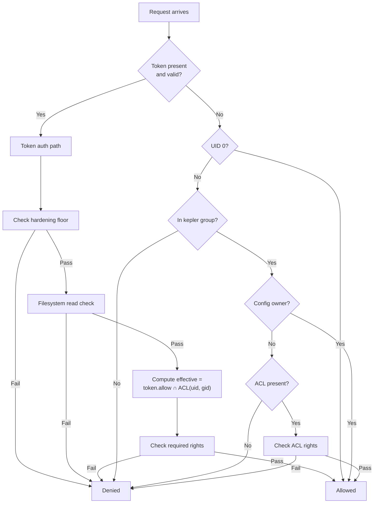
```mermaid
flowchart TD
    A[Request arrives] --> B{Token present<br/>and valid?}
    B -- Yes --> T[Token auth path]
    T --> T1[Check hardening floor]
    T1 -- Fail --> DENY[Denied]
    T1 -- Pass --> T2[Filesystem read check]
    T2 -- Fail --> DENY
    T2 -- Pass --> T3["Compute effective =<br/>token.allow ∩ ACL(uid, gid)"]
    T3 --> T4[Check required rights]
    T4 -- Fail --> DENY
    T4 -- Pass --> ALLOW[Allowed]

    B -- No --> C{UID 0?}
    C -- Yes --> ALLOW
    C -- No --> D{In kepler group?}
    D -- No --> DENY
    D -- Yes --> E{Config owner?}
    E -- Yes --> ALLOW
    E -- No --> F{ACL present?}
    F -- No --> DENY
    F -- Yes --> G[Check ACL rights]
    G -- Fail --> DENY
    G -- Pass --> ALLOW
```

For Token-authenticated requests specifically:

```
1. Token lookup              → does the request carry a valid bearer token?
2. Hardening floor check    → is --hardening ≥ process.hardening?
3. Filesystem read check    → caller must have Unix read permission on the config file (Root bypasses)
4. ACL gate                 → effective = Process.allow ∩ ACL(uid, gid)
5. Rights check             → does effective contain the required rights?
```

If any step fails, the request is denied. Steps 2-5 also apply to Group auth (with the ACL as sole gate instead of intersection).

See [Security Model](security-model.md#effective-permissions) for the user-facing authorization formulas and examples.

### Sanitized Error Responses

Authorization errors (ACL denial, invalid token, group membership rejection) return generic "permission denied" messages to the client. Detailed information (UID, GID, required rights, `kepler` group GID) is logged server-side only. This prevents information leakage that could aid enumeration attacks.

Privilege escalation errors remain detailed since they are only returned to authenticated users who already know their own context.

### Kepler Group Stripping Implementation

Instead of using `initgroups()` (which loads all supplementary groups including `kepler`), the daemon computes an explicit group list excluding the kepler GID and uses `setgroups()`. If computing the stripped group list fails, the service refuses to start (hard failure, not fallback to empty groups).

See [Security Model](security-model.md#kepler-group-stripping) for user-facing documentation on when and why stripping occurs.

### Relevant Files

| File | Description |
|------|-------------|
| `kepler-protocol/src/server.rs` | Peer credential verification, connection limits |
| `kepler-daemon/src/main.rs` | State directory hardening, symlink checks |
| `kepler-daemon/src/process.rs` | Kepler group stripping, privilege dropping |
| `kepler-daemon/src/config_actor/context.rs` | Token registration, permission store |

---

## Key Files Reference

| Component | File | Description |
|-----------|------|-------------|
| Directory structure | `kepler-daemon/src/lib.rs` | State directory paths |
| Secure file writing | `kepler-daemon/src/persistence.rs` | File permissions |
| Socket security | `kepler-protocol/src/server.rs` | Group-based access control |
| Config loading | `kepler-daemon/src/config_actor/` | Lifecycle management, event channels |
| Env expansion | `kepler-daemon/src/config/expand.rs` | `${{ }}$` inline Lua expression evaluation |
| Env building | `kepler-daemon/src/env.rs` | Priority merging |
| Lua evaluation | `kepler-daemon/src/lua/` | Sandbox implementation, ACL runtime, templating |
| Process spawning | `kepler-daemon/src/process/` | Security controls, privilege dropping |
| Event system | `kepler-daemon/src/events.rs` | ServiceEvent types, event channels |
| Dependency graph | `kepler-daemon/src/deps.rs` | Start/stop ordering, condition checking |
| Service orchestration | `kepler-daemon/src/orchestrator/` | Event handling, restart propagation |
| Health checking | `kepler-daemon/src/health.rs` | Health check loop, event emission |
| Resource monitoring | `kepler-daemon/src/monitor/` | CPU/memory metric collection to SQLite |
| Shared DB cleanup | `kepler-daemon/src/db_cleanup.rs` | Batched retention cleanup (logs + monitor) |
| Log writing | `kepler-daemon/src/logs/log_writer.rs` | Per-service LogWriter |
| Log reading | `kepler-daemon/src/logs/log_reader.rs` | SqliteLogReader (read-only queries, filter injection) |

---

## See Also

- [Documentation Index](README.md) -- All documentation pages
- [Configuration](configuration.md) -- YAML config reference
- [Service Lifecycle](service-lifecycle.md) -- Status states and start modes
- [Dependencies](dependencies.md) -- Dependency conditions and ordering
- [Security Model](security-model.md) -- Root, kepler group, and auth
- [Protocol](protocol.md) -- Multiplexed IPC reference
