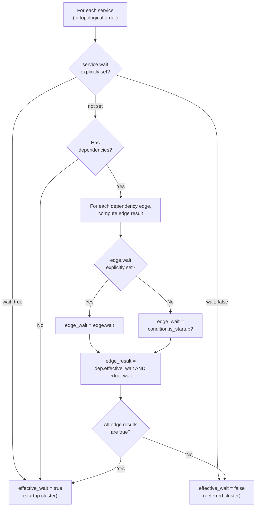

# Dependencies

Kepler supports Docker Compose-compatible dependency configuration with conditions, timeouts, and restart propagation.

## Table of Contents

- [Configuration Format](#configuration-format)
- [Dependency Conditions](#dependency-conditions)
- [Startup vs Deferred Conditions](#startup-vs-deferred-conditions)
- [The wait Field](#the-wait-field)
- [Startup Cluster Computation](#startup-cluster-computation)
- [Dependency Timeout](#dependency-timeout)
- [Restart Propagation](#restart-propagation)
- [Exit Code Filters](#exit-code-filters)
- [Permanently Unsatisfied Dependencies](#permanently-unsatisfied-dependencies)
- [Topological Ordering](#topological-ordering)
- [Examples](#examples)

---

## Configuration Format

### Simple Form

List dependency names. Each uses the default condition (`service_started`):

```yaml
depends_on:
  - database
  - cache
```

### Extended Form

Specify conditions, timeouts, and restart propagation per dependency:

```yaml
depends_on:
  database:
    condition: service_healthy    # Wait for database health checks to pass
    timeout: 30s                  # Optional timeout for condition
    restart: true                 # Restart this service when database restarts
  cache:
    condition: service_started    # Just wait for cache to be running
```

### Dependency Edge Options

| Option | Type | Default | Description |
|--------|------|---------|-------------|
| `condition` | `string` | `service_started` | When to consider dependency ready |
| `timeout` | `duration` | global | Max time to wait for condition (falls back to `kepler.timeout`) |
| `restart` | `bool` | `false` | Restart this service when dependency restarts |
| `exit_code` | `list` | none | Exit code filter for `service_failed`/`service_stopped` |
| `wait` | `bool` | condition default | Override whether `--wait`/foreground blocks on this dependency |

---

## Dependency Conditions

| Condition | Default wait | Description |
|-----------|-------------|-------------|
| `service_started` | **startup** | Dependency status is Running, Healthy, or Unhealthy (default) |
| `service_healthy` | **startup** | Dependency status is Healthy (requires healthcheck) |
| `service_completed_successfully` | **startup** | Dependency exited with code 0 |
| `service_unhealthy` | **deferred** | Dependency was Healthy then became Unhealthy (requires healthcheck) |
| `service_failed` | **deferred** | Dependency failed: Exited with non-zero code, Killed by signal, or Failed (spawn error). Optional `exit_code` filter |
| `service_stopped` | **deferred** | Dependency is Stopped, Exited, Killed, or Failed. Optional `exit_code` filter |

---

## Startup vs Deferred Conditions

Conditions are classified as **startup** (naturally resolved during startup) or **deferred** (reactive, waiting for transitions that may not happen during startup). This classification determines how `start`, `start --wait`, and `start -d` behave.

**Startup conditions** (`service_started`, `service_healthy`, `service_completed_successfully`):
- Resolve naturally as services start up
- Services waiting on these are part of the **startup cluster**
- `--wait` blocks until these are satisfied

**Deferred conditions** (`service_unhealthy`, `service_failed`, `service_stopped`):
- Wait for failure or degradation events that may never happen
- Services waiting on these are part of the **deferred cluster**
- `--wait` does NOT block for these (they start in the background)

| Start Mode | Startup cluster | Deferred cluster |
|------------|----------------|-----------------|
| `start` (foreground) | Started level-by-level, blocking | Spawned in background |
| `start -d` | All started in background | All started in background |
| `start -d --wait` | Started level-by-level, blocks CLI | Spawned in background, CLI returns |

---

## The `wait` Field

The `wait` field provides explicit control over startup/deferred classification at two levels:

### Service Level

Override the computed classification entirely:

```yaml
services:
  # Force into startup cluster despite deferred dependencies
  monitor:
    wait: true
    depends_on:
      app:
        condition: service_failed

  # Force into deferred cluster despite startup dependencies
  optional-worker:
    wait: false
    depends_on:
      database:
        condition: service_healthy
```

### Edge Level

Override a single dependency edge's default classification:

```yaml
depends_on:
  long_batch_job:
    condition: service_completed_successfully
    wait: false   # Don't block --wait for this edge
  app:
    condition: service_failed
    wait: true    # Treat this edge as startup
```

---

## Startup Cluster Computation

The startup cluster is computed transitively using these rules:

1. Services are sorted in **topological order** (dependencies before dependents)
2. For each service (in order), compute `effective_wait`:
   - If `service.wait` is explicitly set → use that value
   - If the service has no dependencies → `true` (startup)
   - Otherwise: `AND` of `(dependency.effective_wait AND edge_wait)` for each edge
3. `edge_wait` for each dependency edge:
   - `dep_config.wait` if explicitly set on the edge
   - Otherwise, `condition.is_startup_condition()`

### Algorithm Flowchart



### Propagation Example

```yaml
services:
  database:
    command: ["postgres"]
    healthcheck:
      test: ["pg_isready"]
  app:
    command: ["./server"]
    depends_on:
      database:
        condition: service_healthy
  monitor:
    command: ["./alert-on-failure"]
    depends_on:
      app:
        condition: service_failed
  alerter:
    command: ["./send-alerts"]
    depends_on:
      monitor:
        condition: service_started
```

Resolution:

| Service | Computation | Result |
|---------|-------------|--------|
| `database` | No deps | startup |
| `app` | `database.effective_wait(true) AND service_healthy.startup(true)` = `true` | startup |
| `monitor` | `app.effective_wait(true) AND service_failed.startup(false)` = `false` | **deferred** |
| `alerter` | `monitor.effective_wait(false) AND service_started.startup(true)` = `false` | **deferred** |

Note that deferred status **propagates downstream**: even though `alerter` uses `service_started` (normally startup), its dependency `monitor` is deferred, making `alerter` deferred too.

---

## Dependency Timeout

Each dependency edge has an effective timeout: `dep.timeout ?? kepler.timeout ?? none`.

```yaml
kepler:
  timeout: 30s    # Global default

services:
  backend:
    depends_on:
      database:
        condition: service_healthy
        timeout: 60s    # Override: wait up to 60s for this specific dependency
      cache:
        condition: service_started
        # Uses global 30s timeout
```

If no timeout is configured at either level, the wait has no timeout (waits indefinitely or until permanently unsatisfied).

---

## Restart Propagation

When `restart: true` is set on a dependency edge, the dependent service restarts when its dependency restarts:

1. Dependency restarts (for any reason)
2. Dependent service is stopped
3. System waits for the dependency's condition to be met again (with timeout)
4. Dependent service is restarted

```yaml
services:
  database:
    command: ["postgres"]
    healthcheck:
      test: ["pg_isready"]

  backend:
    command: ["./server"]
    depends_on:
      database:
        condition: service_healthy
        restart: true  # Backend restarts when database restarts
```

When database restarts:
1. Backend is stopped
2. System waits for database to become healthy
3. Backend is restarted

This is useful for services that need to reconnect or reinitialize when their dependencies restart.

---

## Exit Code Filters

The `service_failed` and `service_stopped` conditions support exit code filters:

```yaml
depends_on:
  worker:
    condition: service_failed
    exit_code: [1, "5:10"]    # Match exit code 1, or range 5-10
```

- Single values: `[1, 2, 3]`
- Ranges: `["1:10"]` (inclusive)
- Mixed: `[5, "1:10"]`

The condition is only satisfied if the exit code matches the filter.

---

## Permanently Unsatisfied Dependencies

A dependency is **permanently unsatisfied** when:

1. The dependency service is in a terminal state (Stopped, Exited, Killed, or Failed)
2. Its restart policy won't restart it (e.g., `restart: no` or `restart: on-failure` with exit code 0)
3. The condition is not currently satisfied

When this happens, the dependent service is marked as **Failed** instead of waiting indefinitely. This allows foreground mode to detect quiescence and exit cleanly.

---

## Topological Ordering

Before starting services, Kepler sorts them in topological order using Kahn's algorithm. This ensures:
- Dependencies start before dependents
- Services at the same level can start in parallel
- Circular dependencies are detected and rejected

---

## Examples

### Web App with Database

```yaml
services:
  database:
    command: ["postgres"]
    healthcheck:
      test: ["pg_isready"]
      interval: 5s
      retries: 5

  backend:
    command: ["./server"]
    depends_on:
      database:
        condition: service_healthy
        restart: true
```

### Migration Before App

```yaml
services:
  migration:
    command: ["./migrate"]
    restart: no

  app:
    command: ["./server"]
    depends_on:
      migration:
        condition: service_completed_successfully
```

### Failure Monitor

```yaml
services:
  app:
    command: ["./server"]
    restart: always

  monitor:
    command: ["./alert-on-failure"]
    depends_on:
      app:
        condition: service_failed
```

### Mixed Startup and Deferred

```yaml
kepler:
  timeout: 30s

services:
  database:
    command: ["postgres"]
    healthcheck:
      test: ["pg_isready"]

  app:
    command: ["./server"]
    depends_on:
      database:
        condition: service_healthy

  # Deferred: waits for app to fail
  error-handler:
    command: ["./handle-errors"]
    depends_on:
      app:
        condition: service_failed

  # Force into startup despite deferred dependency
  critical-monitor:
    wait: true
    command: ["./monitor"]
    depends_on:
      app:
        condition: service_failed
```

---

## See Also

- [Service Lifecycle](service-lifecycle.md) -- Status states and start modes
- [Health Checks](health-checks.md) -- Health check conditions
- [Configuration](configuration.md) -- Full config reference
- [Architecture](architecture.md#dependency-management) -- Internal implementation details
