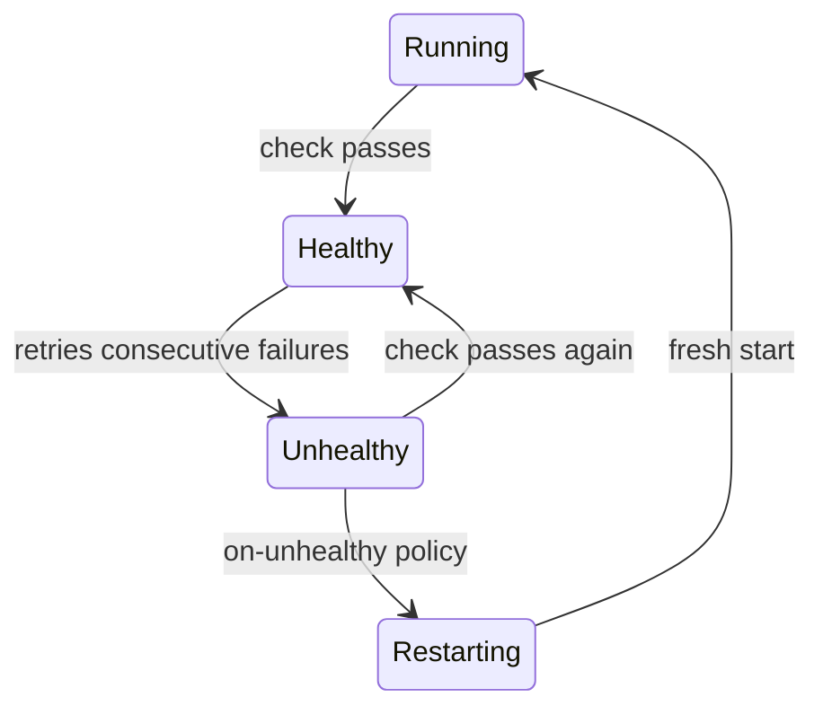

# Health Checks

Docker-compatible health check configuration for monitoring service readiness.

## Table of Contents

- [Configuration](#configuration)
- [Health Check Behavior](#health-check-behavior)
- [Command Format](#command-format)
- [Status Integration](#status-integration)
- [Dependency Integration](#dependency-integration)
- [Health Check Hooks](#health-check-hooks)
- [Examples](#examples)

---

## Configuration

Health checks are configured under the `healthcheck` key in a service definition:

```yaml
services:
  backend:
    command: ["./server"]
    healthcheck:
      test: ["sh", "-c", "curl -f http://localhost:3000/health || exit 1"]
      interval: 10s
      timeout: 5s
      retries: 3
      start_period: 5s
```

| Option | Type | Default | Description |
|--------|------|---------|-------------|
| `test` | `string[]` | required | Health check command |
| `interval` | `duration` | `30s` | Time between checks |
| `timeout` | `duration` | `30s` | Timeout per check |
| `retries` | `int` | `3` | Consecutive failures before marking unhealthy |
| `start_period` | `duration` | `0s` | Grace period before health checks begin |

**Duration format:** `100ms`, `10s`, `5m`, `1h`, `1d`

---

## Health Check Behavior

### State Transitions

1. Service starts → status is **Running**
2. After `start_period`, health checks begin running every `interval`
3. If the check command exits with code 0 → service becomes **Healthy**
4. If `retries` consecutive checks fail → service becomes **Unhealthy**
5. If a check succeeds after being unhealthy → service returns to **Healthy**
6. If the service has `on-unhealthy` restart flag → service is restarted (see [Restart on Unhealthy](#restart-on-unhealthy))



### Timing

- The first health check runs after `start_period` elapses
- Subsequent checks run every `interval` after the previous check completes
- Each check must complete within `timeout` or it counts as a failure

---

## Command Format

The `test` field takes a command array, identical to Docker's health check format:

```yaml
healthcheck:
  test: ["sh", "-c", "curl -f http://localhost:8080/health || exit 1"]
```

- **Exit code 0**: healthy
- **Any other exit code**: unhealthy
- **Timeout**: counts as a failure

The command runs in the service's environment (with the service's user, working directory, and environment variables).

---

## Status Integration

Health check status is reflected in `kepler ps` output:

| Status | Display |
|--------|---------|
| Running (no healthcheck) | `Up 5m` |
| Running (healthcheck configured, not yet passed) | `Up 5m` |
| Healthy | `Up 5m (healthy)` |
| Unhealthy | `Up 2m (unhealthy)` |

---

## Dependency Integration

Health checks integrate with the dependency system through two conditions:

### `service_healthy`

Wait for a dependency to become healthy before starting:

```yaml
depends_on:
  database:
    condition: service_healthy    # Wait for healthcheck to pass
```

This is a **startup** condition -- the CLI blocks until it's satisfied.

### `service_unhealthy`

React when a dependency becomes unhealthy:

```yaml
depends_on:
  database:
    condition: service_unhealthy  # React when healthcheck fails
```

This is a **deferred** condition -- the service starts in the background.

See [Dependencies](dependencies.md) for full details.

---

## Health Check Hooks

Two service hooks fire on health check state transitions:

| Hook | Description |
|------|-------------|
| `post_healthcheck_success` | Runs when service transitions to Healthy |
| `post_healthcheck_fail` | Runs when service transitions to Unhealthy |

```yaml
services:
  backend:
    command: ["./server"]
    healthcheck:
      test: ["sh", "-c", "curl -f http://localhost:3000/health"]
      interval: 10s
      retries: 3
    hooks:
      post_healthcheck_success:
        run: echo "Backend is now healthy"
      post_healthcheck_fail:
        run: ./alert-team.sh "Backend health check failed"
```

See [Hooks](hooks.md) for full hook documentation.

---

## Restart on Unhealthy

When a service has the `on-unhealthy` restart flag, it is automatically restarted when it becomes unhealthy. This can be combined with other restart flags using the pipe (`|`) operator:

```yaml
services:
  backend:
    command: ["./server"]
    restart: "on-failure|on-unhealthy"
    healthcheck:
      test: ["sh", "-c", "curl -f http://localhost:3000/health || exit 1"]
      interval: 10s
      timeout: 5s
      retries: 3
```

### Behavior

1. Health check fails `retries` consecutive times → service becomes **Unhealthy**
2. `post_healthcheck_fail` hook runs (if configured) and completes
3. Service is stopped and restarted
4. After restart, the health check starts fresh (failure counter resets to 0)

### Restart Loop Safety

Natural safeguards prevent tight restart loops:
- After restart, a fresh health check cycle begins with zero failures
- Minimum time between unhealthy-triggered restarts: `start_period + (retries × interval)`
- While a restart is in progress, no new unhealthy events are emitted

### Hook Ordering

When both `post_healthcheck_fail` hook and `on-unhealthy` restart are configured, the hook runs first and completes before the restart is triggered. This allows cleanup or notification before the service restarts:

```yaml
services:
  backend:
    command: ["./server"]
    restart: "on-unhealthy"
    healthcheck:
      test: ["sh", "-c", "curl -f http://localhost:3000/health"]
      interval: 10s
      retries: 3
    hooks:
      post_healthcheck_fail:
        run: ./notify-team.sh "Backend is unhealthy, restarting..."
```

> **Note:** `restart: always` includes the `on-unhealthy` flag. Services with `restart: always` and a healthcheck will automatically restart when unhealthy.

---

## Examples

### HTTP Health Check

```yaml
healthcheck:
  test: ["sh", "-c", "curl -f http://localhost:8080/health || exit 1"]
  interval: 10s
  timeout: 5s
  retries: 3
  start_period: 10s
```

### Database Readiness

```yaml
healthcheck:
  test: ["pg_isready", "-U", "postgres"]
  interval: 5s
  timeout: 5s
  retries: 5
  start_period: 10s
```

### Custom Script

```yaml
healthcheck:
  test: ["sh", "-c", "test -f /tmp/healthy"]
  interval: 15s
  retries: 2
```

### TCP Port Check

```yaml
healthcheck:
  test: ["sh", "-c", "nc -z localhost 6379"]
  interval: 5s
  timeout: 3s
  retries: 3
```

---

## See Also

- [Service Lifecycle](service-lifecycle.md) -- Status states including Healthy/Unhealthy
- [Dependencies](dependencies.md) -- `service_healthy` and `service_unhealthy` conditions
- [Hooks](hooks.md) -- Health check hooks
- [Configuration](configuration.md) -- Full config reference
