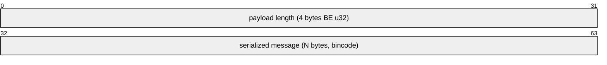
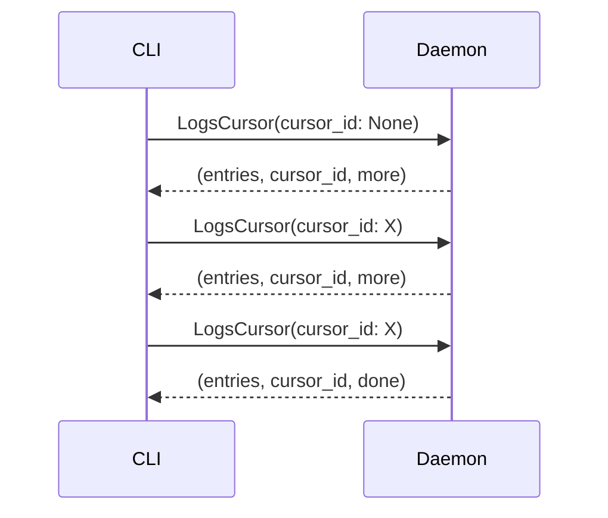

# Protocol

Kepler's multiplexed IPC protocol for CLI-daemon communication.

## Table of Contents

- [Connection Model](#connection-model)
- [Message Types](#message-types)
- [Request Types](#request-types)
- [Response Types](#response-types)
- [Progress Events](#progress-events)
- [Wire Format](#wire-format)
- [Cursor-Based Log Streaming](#cursor-based-log-streaming)
- [Error Handling](#error-handling)

---

## Connection Model

Kepler uses a **multiplexed, persistent** connection model over Unix domain sockets:

- **Single connection**: The CLI maintains one connection to the daemon
- **Multiplexed**: Multiple requests can be in-flight concurrently on the same connection
- **Persistent**: The connection stays open for the duration of the CLI session
- **Non-blocking**: Client methods take `&self` (not `&mut self`), allowing concurrent usage

The daemon spawns a per-request handler task for each incoming request, with a shared mpsc writer channel for sending responses back to the client.

---

## Message Types

### Client → Daemon

```
RequestEnvelope {
    id: u64,            # Unique request identifier
    request: Request,   # The actual request
}
```

Each request is wrapped in an envelope with a unique ID. This allows the daemon to send responses and events for multiple concurrent requests.

### Daemon → Client

```
ServerMessage {
    id: u64,                    # Matches the request envelope ID
    payload: ServerPayload,     # Response or event
}
```

The `ServerPayload` is either:
- A **response** (final result for the request)
- A **progress event** (intermediate update)

---

## Request Types

| Request | Description |
|---------|-------------|
| `StartDaemon` | Start the daemon |
| `StopDaemon` | Stop the daemon (stops all services first) |
| `RestartDaemon` | Restart the daemon |
| `DaemonStatus` | Get daemon info and loaded configs |
| `Start` | Start services for a config |
| `Stop` | Stop services (with optional signal) |
| `Restart` | Restart services |
| `Recreate` | Re-bake config snapshot |
| `ServiceStatus` | Get status of services |
| `LogsCursor` | Request log entries (cursor-based) |
| `FollowLogs` | Stream logs continuously |
| `Prune` | Remove stopped/orphaned config state |
| `CancelFollowLogs` | Cancel an active log follow |

---

## Response Types

Every request receives either:
- **Ok** with optional `ResponseData`
- **Error** with an error message

Response data variants include:
- `ServiceInfo` -- Service status list (for `ServiceStatus`)
- `LogEntries` -- Log lines with cursor (for `LogsCursor`)
- `DaemonInfo` -- Daemon status (for `DaemonStatus`)
- `PruneResult` -- Pruned config list (for `Prune`)

---

## Progress Events

Long-running operations (Start, Stop, Restart) send progress events to the client:

| Event | Description |
|-------|-------------|
| `ServicePhase` | A service has transitioned to a new phase |
| `LogEntry` | A log line during follow mode |
| `Complete` | The operation has completed |

`ServicePhase` variants track the lifecycle:
- Starting, Started, Stopping, Stopped, Failed, Healthy, Unhealthy, Exited
- Each includes the service name and relevant details (exit code, signal, etc.)

---

## Wire Format

Messages are encoded using a length-prefixed binary format:



1. **4-byte big-endian length prefix**: Size of the serialized payload
2. **Bincode payload**: The message serialized using the `bincode` crate

Both `RequestEnvelope` and `ServerMessage` use this format.

---

## Cursor-Based Log Streaming

Log retrieval uses server-side cursors for efficient pagination:



- **cursor_id**: Opaque identifier for the cursor position
- **entries**: Batch of log lines
- **more/done**: Whether more entries are available

Cursors track byte offsets per log file and detect file truncation (resetting automatically).

Stale cursors are cleaned up after 5 minutes of inactivity.

---

## Error Handling

### Client Errors

| Error | Description |
|-------|-------------|
| `Disconnected` | Connection to daemon was lost |
| `ConnectionFailed` | Could not connect to daemon socket |
| `ProtocolError` | Invalid message format |
| `Timeout` | Request timed out |

### Server Errors

Server errors are returned as error responses with descriptive messages. Common errors include:
- Config not found
- Services not stopped (for recreate)
- Invalid service name
- Permission denied

---

## See Also

- [Architecture](architecture.md) -- Internal implementation details
- [CLI Reference](cli-reference.md) -- Commands that use the protocol
- [Security Model](security-model.md) -- Socket security and authentication
