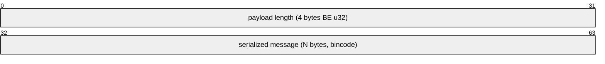
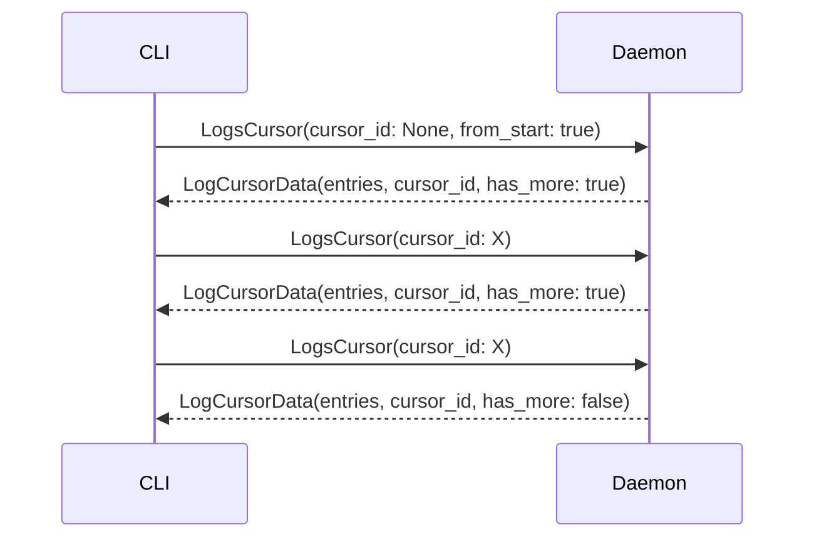

# Protocol

Kepler's multiplexed IPC protocol for CLI-daemon communication.

## Table of Contents

- [Connection Model](#connection-model)
- [Message Types](#message-types)
- [Request Types](#request-types)
- [Response Types](#response-types)
- [Progress Events](#progress-events)
- [Wire Format](#wire-format)
- [Cursor-Based Log Streaming](#cursor-based-log-streaming)
- [Error Handling](#error-handling)

---

## Connection Model

Kepler uses a **multiplexed, persistent** connection model over Unix domain sockets:

- **Single connection**: The CLI maintains one connection to the daemon
- **Multiplexed**: Multiple requests can be in-flight concurrently on the same connection
- **Persistent**: The connection stays open for the duration of the CLI session
- **Non-blocking**: Client methods take `&self` (not `&mut self`), allowing concurrent usage

The daemon spawns a per-request handler task for each incoming request, with a shared mpsc writer channel for sending responses back to the client.

---

## Message Types

### Client → Daemon

```
RequestEnvelope {
    id: u64,                    # Unique request identifier
    request: Request,           # The actual request
    token: Option<[u8; 32]>,    # Bearer token (from KEPLER_TOKEN env var)
}
```

Each request is wrapped in an envelope with a unique ID. This allows the daemon to send responses and events for multiple concurrent requests. The `token` field carries the bearer token for token-based authentication -- it is automatically populated by the client library from the `KEPLER_TOKEN` environment variable when present.

### Daemon → Client

`ServerMessage` is an enum with two variants:

```
ServerMessage::Response {
    id: u64,              # Matches the request envelope ID
    response: Response,   # Final result for the request
}

ServerMessage::Event {
    event: ServerEvent,   # Pushed event (e.g., progress updates)
}
```

- A **Response** is the final result for a request (identified by `id`)
- An **Event** is a server-pushed notification (not tied to a specific response)

---

## Request Types

| Request | Fields | Description |
|---------|--------|-------------|
| `Start` | `config_path`, `service?`, `sys_env?` | Start service(s) for a config |
| `Stop` | `config_path`, `service?`, `clean`, `signal?` | Stop service(s) with optional signal |
| `Restart` | `config_path`, `services[]`, `sys_env?` | Restart service(s) |
| `Recreate` | `config_path`, `sys_env?` | Stop, re-bake config snapshot, start |
| `Status` | `config_path?` | Get service status (None = all configs) |
| `Logs` | `config_path`, `service?`, `follow`, `lines`, `max_bytes?`, `mode`, `no_hooks` | Get logs (one-shot or follow) |
| `LogsChunk` | `config_path`, `service?`, `offset`, `limit`, `no_hooks` | Get log entries with offset/limit pagination |
| `LogsCursor` | `config_path`, `service?`, `cursor_id?`, `from_start`, `no_hooks` | Cursor-based log streaming |
| `Subscribe` | `config_path`, `services?` | Subscribe to service state change events |
| `Inspect` | `config_path` | Inspect config and runtime state (JSON output) |
| `Shutdown` | *(none)* | Shutdown the daemon |
| `Ping` | *(none)* | Check if daemon is alive |
| `ListConfigs` | *(none)* | List all loaded configs |
| `Prune` | `force`, `dry_run` | Remove stopped/orphaned config state |

---

## Response Types

Every request receives either:
- **Ok** with optional message and/or `ResponseData`
- **Error** with an error message

```
Response::Ok {
    message: Option<String>,
    data: Option<ResponseData>,
}

Response::Error {
    message: String,
}
```

### ResponseData Variants

| Variant | Payload | Used by |
|---------|---------|---------|
| `ServiceStatus` | `HashMap<String, ServiceInfo>` | `Status` (single config) |
| `MultiConfigStatus` | `Vec<ConfigStatus>` | `Status` (all configs) |
| `ConfigList` | `Vec<LoadedConfigInfo>` | `ListConfigs` |
| `Logs` | `Vec<LogEntry>` | `Logs` |
| `LogChunk` | `LogChunkData` | `LogsChunk` |
| `LogCursor` | `LogCursorData` | `LogsCursor` |
| `DaemonInfo` | `DaemonInfo` | `Ping` |
| `PrunedConfigs` | `Vec<PrunedConfigInfo>` | `Prune` |
| `Inspect` | `String` | `Inspect` (pre-built JSON) |

### Key Data Structures

**ServiceInfo** -- Status information for a single service:

| Field | Type | Description |
|-------|------|-------------|
| `status` | `String` | Service status (e.g., "running", "stopped", "exited") |
| `pid` | `Option<u32>` | Process ID (if running) |
| `started_at` | `Option<i64>` | Start timestamp |
| `stopped_at` | `Option<i64>` | Stop/exit/fail timestamp |
| `health_check_failures` | `u32` | Health check failure count |
| `exit_code` | `Option<i32>` | Exit code (for exited services) |
| `signal` | `Option<i32>` | Signal that killed the process (e.g., 9 for SIGKILL) |

**LogEntry** -- A log line:

| Field | Type | Description |
|-------|------|-------------|
| `service` | `String` | Service name |
| `line` | `String` | Log line content |
| `timestamp` | `Option<i64>` | Timestamp (ms since Unix epoch) |
| `stream` | `StreamType` | `Stdout` or `Stderr` |

---

## Progress Events

Long-running operations (Start, Stop, Restart) send progress events to the client as `ServerMessage::Event` messages:

```
ServerEvent::Progress {
    request_id: u64,          # Matches the original request envelope ID
    event: ProgressEvent,
}

ProgressEvent {
    service: String,          # Service name
    phase: ServicePhase,      # Current phase
}
```

### ServicePhase Variants

| Phase | Fields | Description |
|-------|--------|-------------|
| `Pending` | `target: ServiceTarget` | Queued, waiting to start (target: `Started` or `Healthy`) |
| `Waiting` | *(none)* | Waiting for dependencies to be satisfied |
| `Starting` | *(none)* | Process is being spawned |
| `Started` | *(none)* | Process is running |
| `Healthy` | *(none)* | Health check is passing |
| `Stopping` | *(none)* | Stop signal sent, waiting for exit |
| `Stopped` | *(none)* | Process has stopped |
| `Cleaning` | *(none)* | Cleanup hooks are running |
| `Cleaned` | *(none)* | Cleanup hooks completed |
| `Failed` | `message: String` | Operation failed (with reason) |

---

## Wire Format

Messages are encoded using a length-prefixed binary format:



1. **4-byte big-endian length prefix**: Size of the serialized payload
2. **Bincode payload**: The message serialized using the `bincode` crate

Both `RequestEnvelope` and `ServerMessage` use this format. Maximum message size is 10 MB.

---

## Cursor-Based Log Streaming

Log retrieval uses server-side cursors for efficient streaming and pagination:



**LogCursorData** contains:

| Field | Type | Description |
|-------|------|-------------|
| `service_table` | `Vec<String>` | Service name lookup table |
| `entries` | `Vec<CursorLogEntry>` | Compact log entries (service stored as u16 index into `service_table`) |
| `cursor_id` | `String` | Opaque cursor ID for next request |
| `has_more` | `bool` | Whether more entries are available |

- **`from_start: true`**: Start cursor at beginning of log files (for reading all logs)
- **`from_start: false`**: Start cursor at end of log files (for follow mode)
- Cursors track byte offsets per log file and detect file truncation (resetting automatically)
- Stale cursors are cleaned up after 5 minutes of inactivity

---

## Error Handling

### Protocol Errors

| Error | Description |
|-------|-------------|
| `Encode` | Failed to encode message (bincode serialization error) |
| `Decode` | Failed to decode message (bincode deserialization error) |
| `MessageTooLarge` | Message exceeds maximum size (10 MB) |

### Client Errors

| Error | Description |
|-------|-------------|
| `Connect` | Failed to create socket connection |
| `Send` | Failed to send request (includes request type) |
| `Receive` | Failed to receive response (includes request type) |
| `MessageTooLarge` | Response message exceeds maximum size |
| `Disconnected` | Connection to daemon was lost |
| `Protocol` | Underlying protocol error (encode/decode) |

### Server Errors

Server errors are returned as `Response::Error` with descriptive messages. The `ServerError` type also covers infrastructure failures:

- Socket binding and permission errors
- Peer credential verification failures
- Unauthorized connections (user not in `kepler` group)
- Message send/receive failures

---

## See Also

- [Architecture](architecture.md) -- Internal implementation details
- [CLI Reference](cli-reference.md) -- Commands that use the protocol
- [Security Model](security-model.md) -- Socket security and authentication
