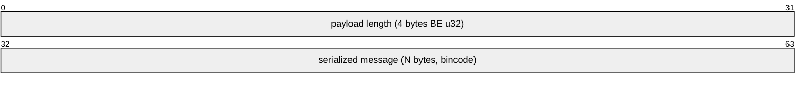
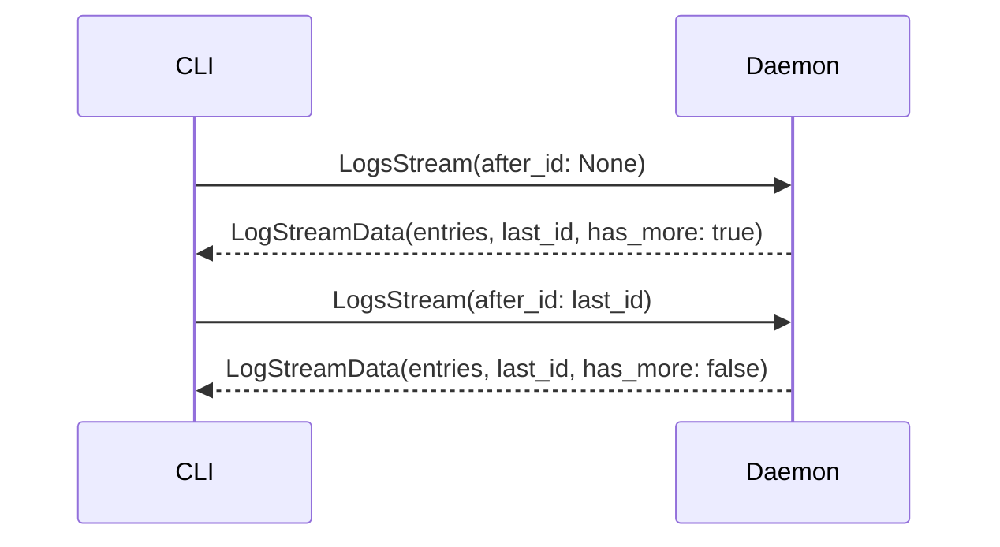

# Protocol

Kepler's multiplexed IPC protocol for CLI-daemon communication.

## Table of Contents

- [Connection Model](#connection-model)
- [Message Types](#message-types)
- [Request Types](#request-types)
- [Response Types](#response-types)
- [Server Events](#server-events)
- [Wire Format](#wire-format)
- [Log Streaming](#log-streaming)
- [Error Handling](#error-handling)

---

## Connection Model

Kepler uses a **multiplexed, persistent** connection model over Unix domain sockets:

- **Single connection**: The CLI maintains one connection to the daemon
- **Multiplexed**: Multiple requests can be in-flight concurrently on the same connection
- **Persistent**: The connection stays open for the duration of the CLI session
- **Non-blocking**: Client methods take `&self` (not `&mut self`), allowing concurrent usage

The daemon spawns a per-request handler task for each incoming request, with a shared mpsc writer channel for sending responses back to the client.

---

## Message Types

### Client → Daemon

```
RequestEnvelope {
    id: u64,                    # Unique request identifier
    request: Request,           # The actual request
    token: Option<[u8; 32]>,    # Bearer token (from KEPLER_TOKEN env var)
}
```

Each request is wrapped in an envelope with a unique ID. This allows the daemon to send responses and events for multiple concurrent requests. The `token` field carries the bearer token for token-based authentication -- it is automatically populated by the client library from the `KEPLER_TOKEN` environment variable when present.

### Daemon → Client

`ServerMessage` is an enum with two variants:

```
ServerMessage::Response {
    id: u64,              # Matches the request envelope ID
    response: Response,   # Final result for the request
}

ServerMessage::Event {
    event: ServerEvent,   # Pushed event (e.g., progress updates)
}
```

- A **Response** is the final result for a request (identified by `id`)
- An **Event** is a server-pushed notification (not tied to a specific response)

---

## Request Types

| Request | Fields | Description |
|---------|--------|-------------|
| `Start` | `config_path`, `services[]`, `sys_env?`, `no_deps`, `override_envs?`, `hardening?` | Start service(s) for a config |
| `Stop` | `config_path`, `services[]`, `clean`, `signal?` | Stop service(s) with optional signal |
| `Restart` | `config_path`, `services[]`, `sys_env?`, `no_deps`, `override_envs?` | Restart service(s) |
| `Recreate` | `config_path`, `sys_env?`, `hardening?` | Stop, re-bake config snapshot, start |
| `Status` | `config_path?` | Get service status (`None` = all configs) |
| `LogsStream` | `config_path`, `service?`, `after_id?`, `from_end`, `limit`, `no_hooks`, `filter?`, `raw`, `tail` | Streaming log retrieval. Requires `logs` right; `logs:search` sub-right when `filter` is set |
| `SubscribeLogs` | `config_path` | Subscribe to log-available notifications. Pushes `LogsAvailable` events when new logs are flushed. Requires `logs` right |
| `Subscribe` | `config_path`, `services?` | Subscribe to service state change events |
| `Inspect` | `config_path` | Inspect config and runtime state (JSON output) |
| `CheckQuiescence` | `config_path` | Check if all services are quiescent (settled) |
| `CheckReadiness` | `config_path` | Check if all services are ready (reached target state) |
| `UserRights` | `config_path` | Query effective rights for the calling user on a config |
| `Shutdown` | *(none)* | Shutdown the daemon |
| `Ping` | *(none)* | Check if daemon is alive |
| `ListConfigs` | *(none)* | List all loaded configs |
| `Prune` | `force`, `dry_run` | Remove stopped/orphaned config state |

---

## Response Types

Every request receives one of:
- **Ok** with optional message and/or `ResponseData`
- **Error** with an error message
- **PermissionDenied** with a reason

```
Response::Ok {
    message: Option<String>,
    data: Option<ResponseData>,
}

Response::Error {
    message: String,
}

Response::PermissionDenied {
    message: String,
}
```

### ResponseData Variants

| Variant | Payload | Used by |
|---------|---------|---------|
| `ServiceStatus` | `HashMap<String, ServiceInfo>` | `Status` (single config) |
| `MultiConfigStatus` | `Vec<ConfigStatus>` | `Status` (all configs) |
| `ConfigList` | `Vec<LoadedConfigInfo>` | `ListConfigs` |
| `LogStream` | `LogStreamData` | `LogsStream` |
| `DaemonInfo` | `DaemonInfo` | `Ping` |
| `PrunedConfigs` | `Vec<PrunedConfigInfo>` | `Prune` |
| `Inspect` | `String` | `Inspect` (pre-built JSON) |
| `CheckResult` | `bool` | `CheckQuiescence`, `CheckReadiness` |
| `UserRights` | `Vec<String>` | `UserRights` |

### Key Data Structures

**ServiceInfo** -- Status information for a single service:

| Field | Type | Description |
|-------|------|-------------|
| `status` | `String` | Service status (e.g., "running", "stopped", "exited") |
| `pid` | `Option<u32>` | Process ID (if running) |
| `started_at` | `Option<i64>` | Start timestamp |
| `stopped_at` | `Option<i64>` | Stop/exit/fail timestamp |
| `health_check_failures` | `u32` | Health check failure count |
| `exit_code` | `Option<i32>` | Exit code (for exited services) |
| `signal` | `Option<i32>` | Signal that killed the process (e.g., 9 for SIGKILL) |
| `initialized` | `bool` | Whether the service has completed its first start |
| `skip_reason` | `Option<String>` | Reason for being skipped (when status is "skipped") |
| `fail_reason` | `Option<String>` | Reason for failure (when status is "failed") |

**LogStreamData** -- A batch of log entries:

| Field | Type | Description |
|-------|------|-------------|
| `service_table` | `Vec<String>` | Service name lookup table |
| `entries` | `Vec<StreamLogEntry>` | Compact log entries (service stored as u16 index into `service_table`) |
| `last_id` | `i64` | Row ID of the last entry. Pass as `after_id` in the next request |
| `has_more` | `bool` | Whether more entries are available |

**StreamLogEntry** -- A compact log entry:

| Field | Type | Description |
|-------|------|-------------|
| `service_id` | `u16` | Index into `LogStreamData.service_table` |
| `line` | `String` | Log line content |
| `timestamp` | `i64` | Timestamp (ms since Unix epoch) |
| `level` | `String` | Log level (`"out"`, `"err"`, `"trace"`, `"debug"`, `"info"`, `"warn"`, `"error"`, `"fatal"`) |
| `hook` | `Option<String>` | Hook name (`None` for service process logs) |
| `attributes` | `Option<String>` | Remaining JSON attributes (`None` for non-JSON lines) |

---

## Server Events

The daemon pushes `ServerMessage::Event` messages for asynchronous notifications:

### ServerEvent Variants

| Event | Fields | Description |
|-------|--------|-------------|
| `Progress` | `request_id`, `event: ProgressEvent` | Progress update for a lifecycle operation |
| `Ready` | `request_id` | All services reached their target state (for `--wait`) |
| `Quiescent` | `request_id` | All services settled (for foreground mode exit) |
| `LogsAvailable` | `request_id` | New logs flushed to SQLite. Client should issue `LogsStream` to fetch |
| `UnhandledFailure` | `request_id`, `service`, `exit_code?` | A service failed with no handler (won't restart, no dependent watching) |

### Progress Events

Long-running operations (Start, Stop, Restart) send progress events:

```
ServerEvent::Progress {
    request_id: u64,          # Matches the original request envelope ID
    event: ProgressEvent,
}

ProgressEvent {
    service: String,          # Service name
    phase: ServicePhase,      # Current phase
}
```

### ServicePhase Variants

| Phase | Fields | Description |
|-------|--------|-------------|
| `Pending` | `target: ServiceTarget` | Queued, waiting to start (target: `Started` or `Healthy`) |
| `Waiting` | *(none)* | Waiting for dependencies to be satisfied |
| `Starting` | *(none)* | Process is being spawned |
| `Started` | *(none)* | Process is running |
| `Healthy` | *(none)* | Health check is passing |
| `Stopping` | *(none)* | Stop signal sent, waiting for exit |
| `Stopped` | *(none)* | Process has stopped |
| `Restarting` | *(none)* | Process is being restarted |
| `Cleaning` | *(none)* | Cleanup hooks are running |
| `Cleaned` | *(none)* | Cleanup hooks completed |
| `Skipped` | `reason: String` | Service was skipped (with reason) |
| `Failed` | `message: String` | Operation failed (with reason) |
| `HookStarted` | `hook: String` | A lifecycle hook started execution |
| `HookCompleted` | `hook: String` | A lifecycle hook completed successfully |
| `HookFailed` | `hook: String`, `message: String` | A lifecycle hook failed |

---

## Wire Format

Messages are encoded using a length-prefixed binary format:


```mermaid
packet-beta
  0-31: "payload length (4 bytes BE u32)"
  32-63: "serialized message (N bytes, bincode)"
```

1. **4-byte big-endian length prefix**: Size of the serialized payload
2. **Bincode payload**: The message serialized using the `bincode` crate

Both `RequestEnvelope` and `ServerMessage` use this format. Maximum message size is 10 MB.

---

## Log Streaming

Log retrieval uses rowid-based pagination via `LogsStream`. The client tracks its position by passing `last_id` from the previous response as `after_id` in the next request:


```mermaid
sequenceDiagram
    CLI->>Daemon: LogsStream(after_id: None)
    Daemon-->>CLI: LogStreamData(entries, last_id, has_more: true)
    CLI->>Daemon: LogsStream(after_id: last_id)
    Daemon-->>CLI: LogStreamData(entries, last_id, has_more: false)
```

For follow mode, the client subscribes via `SubscribeLogs` and issues `LogsStream` requests after each `LogsAvailable` event

---

## Error Handling

### Protocol Errors

| Error | Description |
|-------|-------------|
| `Encode` | Failed to encode message (bincode serialization error) |
| `Decode` | Failed to decode message (bincode deserialization error) |
| `MessageTooLarge` | Message exceeds maximum size (10 MB) |

### Client Errors

| Error | Description |
|-------|-------------|
| `Connect` | Failed to create socket connection |
| `Send` | Failed to send request (includes request type) |
| `Receive` | Failed to receive response (includes request type) |
| `MessageTooLarge` | Response message exceeds maximum size |
| `Disconnected` | Connection to daemon was lost |
| `Protocol` | Underlying protocol error (encode/decode) |

### Server Errors

Server errors are returned as `Response::Error` with descriptive messages. The `ServerError` type also covers infrastructure failures:

- Socket binding and permission errors
- Peer credential verification failures
- Unauthorized connections (user not in `kepler` group)
- Message send/receive failures

---

## See Also

- [Architecture](architecture.md) -- Internal implementation details
- [CLI Reference](cli-reference.md) -- Commands that use the protocol
- [Security Model](security-model.md) -- Socket security and authentication
