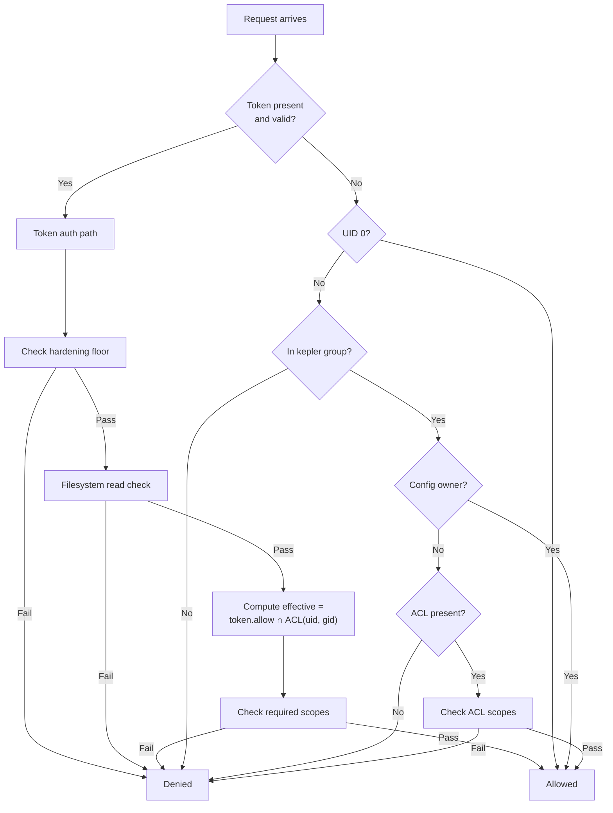

# Security Model

Kepler's security design: root requirement, group-based access, per-config ACLs, token-based service permissions (via the `permissions` field), environment isolation, sandboxing, and hardening.

## Table of Contents

- [Root Requirement](#root-requirement)
- [The kepler Group](#the-kepler-group)
- [Socket Security](#socket-security)
- [State Directory Security](#state-directory-security)
- [Per-Config ACL](#per-config-acl)
- [Filesystem Read Access](#filesystem-read-access)
- [Service Permissions (Token-Based)](#service-permissions-token-based)
- [Effective Permissions](#effective-permissions)
  - [Full Authorization Pipeline](#full-authorization-pipeline)
- [Hardening](#hardening)
- [Environment Isolation](#environment-isolation)
- [Lua Sandbox](#lua-sandbox)
- [Privilege Dropping](#privilege-dropping)

---

## Root Requirement

The daemon must run as root. This is enforced unconditionally on startup -- the daemon exits with an error if not running as root.

Root is required to:
- **Drop privileges** per-service (`setuid`/`setgid`/`initgroups` to configured `user`/`groups`)
- **Create and chown** the state directory and socket to `root:kepler`
- **Set resource limits** on spawned processes (`setrlimit`)

```bash
sudo kepler daemon start -d    # Must be root
```

---

## The `kepler` Group

CLI access to the daemon is controlled via the `kepler` group:

- The install script creates the `kepler` group if it doesn't exist
- Users must be members of the `kepler` group to communicate with the daemon
- Root users always have access regardless of group membership
- By default, only root and the config owner can operate on a config
- Config owners can grant access to other group members via a [per-config ACL](#per-config-acl)

### Adding Users

```bash
sudo usermod -aG kepler username    # Add to `kepler` group
# User must log out and back in for changes to take effect
```

### Verifying Membership

```bash
groups    # Should include "kepler"
```

---

## Socket Security

The daemon creates a Unix domain socket with strict permissions:

- **Path**: `/var/lib/kepler/kepler.sock`
- **Permissions**: `0o660` (`rw-rw----`)
- **Ownership**: `root:kepler`

### Peer Credential Verification

Every connection is verified using Unix peer credentials:

1. Client connects to the socket
2. Daemon reads peer credentials via `peer_cred()`
3. **Root clients** (UID 0) are always allowed
4. **Other clients** are checked for `kepler` group membership:
   - Primary GID is checked
   - Supplementary groups are checked via `getgrouplist()` (cross-platform)
5. Clients not in the `kepler` group are rejected

This ensures that only authorized users can issue commands to the daemon.

### Connection Limits

The server enforces a maximum of 1,024 concurrent connections. When the limit is reached, new connections wait (backpressure) until an existing connection closes. This prevents resource exhaustion from excessive concurrent connections.

---

## State Directory Security

The daemon state directory is secured:

- **Path**: `/var/lib/kepler/` (or `$KEPLER_DAEMON_PATH`)
- **Permissions**: `0o770` (`rwxrwx---`) -- **enforced at every startup**
- **Ownership**: `root:kepler`
- **Daemon umask**: `0o007` on startup

### Startup Hardening

At every daemon startup, the state directory undergoes validation:

1. **Symlink rejection** -- The daemon refuses to start if the state directory is a symlink. This prevents an attacker from redirecting state to an arbitrary location.
2. **Permission enforcement** -- Permissions are unconditionally set to `0o770`, correcting any pre-existing weak permissions (e.g., a directory previously set to `0o777`).
3. **World-access validation** -- After permission enforcement, the daemon verifies no world-accessible bits remain (`mode & 0o007 == 0`).

### Symlink Protection

Symlinks are rejected for critical paths:

- **State directory** -- Checked before any directory operations
- **Socket path** -- Checked before binding; the daemon refuses to bind if `kepler.sock` is a symlink
- **PID file** -- Opened with `O_NOFOLLOW`, so symlinked PID files cause the open to fail with `ELOOP`
- **Log files** -- Opened with `O_NOFOLLOW` to prevent symlink-based write redirection

### Contents

- `kepler.sock` -- Unix domain socket (`0o660`)
- `kepler.pid` -- Daemon PID file (`0o660`, opened with `O_NOFOLLOW`)
- `configs/` -- Per-config state directories

---

## Per-Config ACL

By default, only root and the config owner have access to a config. The config owner is the user who loaded the config (via `kepler start` or `kepler recreate` -- recreating a config transfers ownership to the caller). The `kepler.acl` section allows config owners to grant specific permissions to other `kepler` group members.

> **Migration from pre-ACL versions:** In previous versions, all `kepler` group members had unrestricted access to all configs. With this update, only root and the config owner have access by default. To restore the previous shared-access behavior, add a wildcard ACL:
>
> ```yaml
> kepler:
>   acl:
>     groups:
>       kepler:
>         allow: ["*"]
> ```

### Access Rules

Scoped operations are requests that require specific permission scopes (e.g., `service:start`, `config:status`). Scope-less requests (`Ping`, `ListConfigs`, global `Status`, `Shutdown`, `Prune`) are always allowed through the ACL gate but may still be restricted by other checks (e.g., `Shutdown` and `Prune` are root-only).

1. **Root (UID 0)**: Always has full access -- ACLs are never checked for root
2. **Config owner** (the user who first loaded the config): Always has full access
3. **Other `kepler` group members**:
   - No `acl` section in config → all scoped operations are denied
   - `acl` section present → access restricted to matching user/group rules
   - No matching rules → all scoped operations are denied
   - An empty `acl: {}` section behaves the same as no `acl` section -- non-owner group members are denied all scoped operations because no rules match
4. **Token-based auth**: `effective = Process.allow ∩ ACL(uid, gid)`. Root (uid 0) and config owner have implicit `ACL = *`. See [Effective Permissions](#effective-permissions)

### Configuration

ACLs are defined under `kepler.acl` with `users` and `groups` sub-sections. Keys can be usernames, group names, or numeric UIDs/GIDs. Values specify the allowed scopes.

```yaml
kepler:
  acl:
    users:
      alice:                    # Resolved to UID at config load time
        allow: [service:start, service:stop, config:status]
      1001:                     # Numeric UID
        allow: [service, config:status]
    groups:
      developers:               # Resolved to GID at config load time
        allow: [service:start, config:status]
      2000:                     # Numeric GID
        allow: [config:status]
```

### Scope Hierarchy

ACL scopes use the same hierarchy as [service permissions](#service-permissions-token-based):

| Level    | Examples                            | Description                           |
| -------- | ----------------------------------- | ------------------------------------- |
| Category | `service`, `config`                 | Grants all descendants                |
| Command  | `service:start`, `config:status`    | Grants that specific operation        |
| Wildcard | `*`, `service:*`                    | Grants everything at/below that level |

**Implication rules:**
- Category implies all descendants: `service` → `service:start`, `service:stop`, `service:restart`, `service:clean`, `service:logs`
- Command-level implication: `service:clean` → `service:stop`

```
*
├── service
│   ├── service:start
│   ├── service:stop
│   ├── service:restart
│   ├── service:clean (implies service:stop)
│   └── service:logs
└── config
    ├── config:status
    ├── config:inspect
    ├── config:recreate
    ├── config:hardening
    └── config:env
```

### Available Scopes

| Scope                | Grants                                                                |
| -------------------- | --------------------------------------------------------------------- |
| `service`            | All service operations                                                |
| `service:start`      | Start services                                                        |
| `service:stop`       | Stop services (including with custom signal)                          |
| `service:restart`    | Restart services                                                      |
| `service:clean`      | Stop with `--clean` (implies `service:stop`)                          |
| `service:logs`       | View service logs                                                     |
| `config`             | All config operations                                                 |
| `config:status`      | View config/service status; filters `ListConfigs` and global `Status` |
| `config:inspect`     | Inspect config                                                        |
| `config:recreate`    | Recreate config                                                       |
| `config:hardening`   | Override hardening level (`--hardening` on start and recreate). Only required when the flag is used |
| `config:env`         | Override environment (`-e` / `--refresh-env` on start and restart). Only required when the flag is used |
| `*`                  | Everything                                                            |

### Subscribe Access

The `Subscribe` request does not map to a specific scope in the table above. Instead, it requires the caller to have at least one `service:*` scope (e.g., `service:start`, `service:logs`, or the `service` category). If the caller has no service-related scopes, the subscription is denied. When no ACL rules match at all, `Subscribe` is also denied.

### Rule Matching

When a request arrives from a non-owner group member:

1. The daemon looks up the caller's UID in `acl.users`
2. The daemon looks up the caller's primary GID and all supplementary GIDs in `acl.groups`
3. All matching scopes are **unioned** (a user matching both a user rule and a group rule gets the combined scopes)
4. The request's required scopes are checked against the union
5. If no rules match at all, all scoped operations are denied

### Global Query Filtering

For requests that return cross-config results (`kepler ps --all`, `kepler list`), the daemon filters results by read access. Non-owner group members only see configs where they have `config:status` scope (granted directly or via the `config` category). Configs without an `acl` section are only visible to root and the config owner.

### Daemon-Level Operations

Daemon-level operations (`kepler daemon stop`, `kepler prune`) are restricted to root (UID 0) only. Non-root `kepler` group members cannot shut down the daemon or prune configs. There are no corresponding scopes for these operations -- they are enforced exclusively via UID check.

### Cross-Config Limitation

Process permissions are scoped to the config that registered them. A process authenticated by config A cannot operate on config B's services, unless config B was loaded by that process. Child process permissions are bounded by a [permission ceiling](#permission-ceiling-token-inheritance): `child.allow = expand(permissions.allow) ∩ caller_ceiling`.

### Resolution

User and group names are resolved to numeric UIDs/GIDs **at config load time** using the system user/group databases. This means:

- Name changes after config load have no effect until `kepler recreate`
- Numeric UIDs/GIDs are always accepted and don't require system lookup
- Invalid names cause a config load error

### Examples

#### Read-only access for a team

```yaml
kepler:
  acl:
    groups:
      ops-team:
        allow: [config:status, service:logs]
```

Only the config owner can start/stop services. Members of `ops-team` can view status and logs. Other `kepler` group members are denied all scoped operations.

#### Operator and viewer roles

```yaml
kepler:
  acl:
    users:
      alice:
        allow: [service, config:status]  # Can start/stop + view status and logs (service category includes service:logs)
      bob:
        allow: [config:status]                          # Can only view status
    groups:
      developers:
        allow: [config:status, service:logs]            # Can view status and logs
```

Alice gets full service control. Bob can only check status. All developers can read status and logs. The config owner has unrestricted access regardless.

#### Grant full access to all group members

To allow all `kepler` group members unrestricted access (similar to a shared config), use the `*` wildcard:

```yaml
kepler:
  acl:
    groups:
      kepler:
        allow: ["*"]           # All `kepler` group members get full access

services:
  app:
    command: ["./app"]
```

Without an `acl` section, only root and the config owner can operate on the config.

---

## Filesystem Read Access

Non-root `kepler` group members must have Unix read permission on config files they reference. This check is complementary to the [Per-Config ACL](#per-config-acl) -- both must pass for a request to proceed.

### How It Works

When a non-root user sends a request that references a config path, the daemon checks the file's Unix permission bits:

1. **Owner match** (caller UID == file UID): requires owner read bit (`0o400`)
2. **Group match** (caller's primary or supplementary GIDs include file GID): requires group read bit (`0o040`)
3. **Other**: requires other read bit (`0o004`)

If none of these checks pass, the request is denied with a "Permission denied" error.

### Bypasses

- **Root callers** (UID 0): always bypass this check
- **Token-based callers**: also subject to this check (peer credentials carry UID/GID)

### Relationship to ACL

Both checks are enforced independently:

- A group member with ACL access to a config is still denied if they can't read the config file on disk
- A group member with read access to the file is still denied if they have no matching ACL entry

This prevents users from operating on config files they couldn't read directly, even if they know the path.

---

## Service Permissions (Token-Based)

The `permissions` field on a service controls what daemon operations a spawned service process can perform. When present, the daemon generates a CSPRNG bearer token, registers it with the granted permission scopes, and passes it to the spawned process via the `KEPLER_TOKEN` environment variable. The process presents this token in each request, and the daemon looks up its permissions. See [Effective Permissions](#effective-permissions) for how permission scopes interact with ACLs.

> **Backward compatibility:** The field `security` is accepted as an alias for `permissions`.

### How It Works

1. Config owner defines `permissions` on a service with allowed scopes
2. At service start, the daemon generates a 256-bit CSPRNG bearer token and registers it with the granted permission scopes
3. The daemon sets `KEPLER_TOKEN` (hex-encoded, 64 chars) in the service's environment and spawns the process
4. The spawned process (and any child processes via `fork()`/`exec()` inheritance) connects to the daemon via the Unix socket, presenting the token in each request
5. The daemon looks up the token in the permission store and computes [effective permissions](#effective-permissions) for each request
6. When the service exits, the token registration is revoked

### Token Security

- **CSPRNG**: Tokens are generated via the OS cryptographic random number generator (`getrandom` syscall, 256-bit)
- **Constant-time lookup**: Token lookup uses linear scan with constant-time equality (`subtle::ConstantTimeEq`) to prevent timing side-channels
- **Unpredictable**: Tokens are purely random -- not derived from PID, service name, or timestamps
- **Inheritable**: Child processes automatically inherit the token via standard `fork()`/`exec()` environment inheritance, so all descendants of a service share the same permissions
- **Lifecycle-bound**: Tokens are registered before the process spawns (no race condition) and revoked when the service exits or the config is unloaded
- **Environment variable transport**: The token is passed via the `KEPLER_TOKEN` environment variable, which is readable via `/proc/<pid>/environ` by processes running as the same UID or by root. The token's confidentiality is bounded by Unix process isolation (same-UID boundary). `KEPLER_TOKEN` should not be copied into other environment variables or manipulated by users -- doing so may lead to bugs or security issues when the token is revoked
- **Token stripping**: `KEPLER_TOKEN` is stripped from the caller's environment at config load time and from computed environments before service spawn. This prevents accidental token leakage from the calling process into child configs

### Configuration

**Short form (list shorthand):**

```yaml
services:
  orchestrator:
    command: ["./orchestrator"]
    permissions:
      - service:start
      - service:stop
      - config:status
```

**Object form:**

```yaml
services:
  orchestrator:
    command: ["./orchestrator"]
    permissions:
      allow:                          # General capabilities
        - service:start
        - service:stop
        - config:status
        - service:logs
      hardening: no-root              # Hardening floor for configs spawned by this process
```

| Field       | Type       | Default         | Description                                                                                            |
| ----------- | ---------- | --------------- | ------------------------------------------------------------------------------------------------------ |
| `allow`     | `string[]` | required        | Capability scopes for the process. Subject to [permission ceiling](#permission-ceiling-token-inheritance) and [ACL intersection](#effective-permissions) at request time |
| `hardening` | `string`   | inherited       | Hardening floor for configs spawned by this process. Cannot exceed the parent config's hardening level |

### Permission Lifecycle

- **Registration**: A new token is generated and registered for each service start/restart
- **Scope**: Each registration is bound to its config path and service name
- **Revocation**: Registrations are automatically revoked when the service process exits, or when the config is unloaded (`stop --clean`, `recreate`, `prune`)
- **Isolation**: Each service gets its own independent token -- permissions cannot be shared across unrelated services
- **Inheritance**: Child processes spawned by `fork()`/`exec()` inherit the `KEPLER_TOKEN` environment variable and share the parent's permissions

Scopes use the same hierarchy as [ACL scopes](#available-scopes).

### Without Permissions Field

When no `permissions` field is present, the service process has no token and no ability to authenticate to the daemon. Combined with [`kepler` group stripping](#kepler-group-stripping) (active by default with `no-root` hardening), this means the process has no daemon access at all.

---

## Effective Permissions

Kepler uses a unified authorization model where every request goes through the same gate. The effective permissions depend on the caller type (Root, Group, or Token-authenticated process) and are always bounded by the per-config ACL.

### Authorization Formula

| Caller type | Formula | Description |
|---|---|---|
| **Root** (uid 0, no registration) | `effective = *` | Root always has full access. No ACL check. |
| **Group** (kepler member, no registration) | `effective = ACL(uid, gid)` | Access controlled entirely by ACL. Config owner has implicit `*`. |
| **Token-authenticated** (process with `permissions`) | `effective = Process.allow ∩ ACL(uid, gid)` | Both the process permissions AND the ACL must grant the scope. |

Where `ACL(uid, gid)` resolves to:

| Caller identity | ACL value |
|---|---|
| Root (uid 0) | `*` -- implicit, never checked |
| Config owner | `*` -- implicit, never checked |
| User/group with matching ACL rules | Union of all matching scopes |
| User/group with no matching rules | `∅` (denied) |
| No `acl` section in config | `∅` (denied) |

### Group ∩ ACL

When a `kepler` group member (non-root, no token registration) sends a request, the ACL is the **sole** access control mechanism:

```
effective = ACL(uid, gid)
```

The config owner has implicit `*`, so `effective = *` (unrestricted). For other group members, the ACL rules are the only source of access.

```yaml
# alice (uid 1000) is the config owner — ACL = *
# bob (uid 1001) is in the `kepler` group
kepler:
  acl:
    users:
      bob:
        allow: [config:status, service:logs]
```

```
alice → "kepler stop web"   →  effective = *                             → allowed
bob   → "kepler stop web"   →  effective = {config:status, service:logs} → denied (needs service:stop)
bob   → "kepler ps"         →  effective = {config:status, service:logs} → allowed (needs config:status)
```

### Process ∩ ACL

When a Token-authenticated process sends a request, both layers must agree. The process's permission scopes define the **maximum the process was designed to do**. The ACL defines **what the user is allowed to do on the target config**. The effective permissions are the intersection -- neither layer can escalate beyond the other.

```
effective = Process.allow ∩ ACL(uid, gid)
```

#### Process owned by root or config owner

Root and the config owner have `ACL = *`, so the ACL side drops out:

```
effective = Process.allow ∩ * = Process.allow
```

This is the common case -- a config owner's service gets exactly the scopes declared in `permissions.allow`.

#### Process owned by a non-owner user

When a non-owner user starts a config (access granted via ACL), processes spawned by that config inherit the user's identity. At request time, the process permissions are intersected with the **target** config's ACL:

```yaml
# outer.kepler.yaml — owned by alice
kepler:
  acl:
    users:
      bob:
        allow: [service, config:status]
services:
  manager:
    command: ["./manager"]
    permissions:
      allow: [service:start, service:stop, config:status]
```

```yaml
# inner.kepler.yaml — owned by alice
kepler:
  acl:
    users:
      bob:
        allow: [config:status]
```

Bob starts `outer.kepler.yaml`. The `manager` service gets `Process.allow = {service:start, service:stop, config:status}`. When `manager` connects:

**On `inner.kepler.yaml`** (bob's ACL is narrow):
```
effective = {service:start, service:stop, config:status}  ∩  {config:status}
          = {config:status}
→ can view status, cannot start/stop
```

**On `outer.kepler.yaml`** (bob's ACL is broader):
```
effective = {service:start, service:stop, config:status}  ∩  {service:*, config:status}
          = {service:start, service:stop, config:status}
→ process permissions are the limiting factor
```

### Permission Ceiling (Token Inheritance)

When a Token-authenticated process starts a new config that itself has services with `permissions`, a **permission ceiling** prevents privilege escalation through permission chaining.

The permissions registered for a child service are computed as:

```
child.allow = expand(service.permissions.allow) ∩ caller_ceiling
```

Where `caller_ceiling` is:

| Caller auth type | Ceiling |
|---|---|
| **Token-authenticated** | Parent process's `allow` set |
| **Root** or **Group** | No ceiling (unlimited) |

This guarantees that permissions can never grow in scope across nesting levels:

```
process_N.allow ⊆ process_(N-1).allow ⊆ ... ⊆ process_1.allow
```

#### Example: Three-level nesting

```yaml
# level1.kepler.yaml — started by alice (Group auth, no ceiling)
services:
  orchestrator:
    command: ["./orchestrator"]
    permissions:
      allow: [service, config:status]
```

```yaml
# level2.kepler.yaml — started by orchestrator's process
services:
  worker:
    command: ["./worker"]
    permissions:
      allow: [service:start, service:stop, config:status, config:inspect]
```

```yaml
# level3.kepler.yaml — started by worker's process
services:
  leaf:
    command: ["./leaf"]
    permissions:
      allow: [service, config]
```

Permission computation at each level:

```
orchestrator.allow = expand({service, config:status}) ∩ (no ceiling)
                   = {service:start, service:stop, service:restart, service:clean, service:logs, config:status}

worker.allow       = expand({service:start, service:stop, config:status, config:inspect}) ∩ orchestrator.allow
                   = {service:start, service:stop, config:status}
                     # config:inspect cut — not in orchestrator's ceiling

leaf.allow         = expand({service, config}) ∩ worker.allow
                   = {service:start, service:stop, config:status}
                     # config:inspect, config:recreate, etc. cut — not in worker's ceiling
```

Even though `leaf` declares `allow: [service, config]`, it can never exceed what `orchestrator` was granted. Each nesting level can only narrow, never widen.

### Hardening Floor (Process Constraint)

In addition to scope restriction, token registrations carry a **hardening floor** that constrains which hardening level child configs can use. When a Token-authenticated process starts or recreates a config:

- If `permissions.hardening` is set, the process's registration enforces it as a minimum
- The child config cannot request a lower hardening level
- If no `--hardening` flag is passed, the process's floor becomes the default

```
effective_hardening = max(daemon_floor, process_floor, requested_level)
```

The `max()` comparison uses the ordering `none < no-root < strict`.

> **Note:** When a registered process explicitly requests a hardening level below its floor, the request is **denied** (not silently raised). The `max()` formula applies only when no explicit level is requested — the process's floor becomes the default.

| Process floor | Requested | Effective | Result |
|---|---|---|---|
| `no-root` | (none) | `no-root` | Process floor used as default |
| `no-root` | `strict` | `strict` | Raised above floor -- allowed |
| `no-root` | `none` | -- | **Denied** -- below process floor |
| `none` | `strict` | `strict` | No floor -- requested level used |

```yaml
services:
  orchestrator:
    command: ["./orchestrator"]
    permissions:
      allow: [service, config:status]
      hardening: no-root
```

If the orchestrator tries `kepler start --hardening none inner.kepler.yaml`, the request is denied because `none < no-root`.

### Full Authorization Pipeline

Every request goes through an authorization pipeline. The steps vary by auth type:



For Token-authenticated requests specifically:

```
1. Token lookup              → does the request carry a valid bearer token?
2. Hardening floor check    → is --hardening ≥ process.hardening?
3. Filesystem read check    → caller must have Unix read permission on the config file (Root bypasses)
4. ACL gate                 → effective = Process.allow ∩ ACL(uid, gid)
5. Scope check              → does effective contain the required scopes?
```

If any step fails, the request is denied. Steps 2-5 also apply to Group auth (with the ACL as sole gate instead of intersection).

### Combined Example

Putting it all together -- ACL intersection, permission ceiling, and hardening floor:

```yaml
# deploy.kepler.yaml — owned by alice (uid 1000)
kepler:
  acl:
    users:
      bob:
        allow: [service, config:status]
    groups:
      ops-team:
        allow: [config:status, service:logs]

services:
  deployer:
    command: ["./deployer"]
    permissions:
      allow: [service:start, service:stop, config:status]
      hardening: no-root
```

**Scenario 1: alice starts the config** (owner, Group auth)
```
alice ACL       = * (owner)
effective       = * → allowed

deployer.allow  = expand({service:start, service:stop, config:status}) ∩ (no ceiling)
                = {service:start, service:stop, config:status}
```

**Scenario 2: bob starts the config** (Group auth, ACL grants `service + config:status`)
```
bob ACL         = {service:*, config:status}
effective       = {service:*, config:status} → start allowed

deployer.allow  = expand({service:start, service:stop, config:status}) ∩ (no ceiling)
                = {service:start, service:stop, config:status}
```

Bob uses Group auth (no token registration), so there is no permission ceiling. The deployer gets exactly what `permissions.allow` declares.

**Scenario 3: deployer's process operates on another config**
```yaml
# app.kepler.yaml — owned by alice
kepler:
  acl:
    users:
      bob:
        allow: [config:status]
```

If bob started `deploy.kepler.yaml`, the deployer runs as bob (uid 1001). When it connects to the daemon and operates on `app.kepler.yaml`:
```
effective = Process.allow ∩ ACL(bob, app.kepler)
          = {service:start, service:stop, config:status} ∩ {config:status}
          = {config:status}
→ can view status, cannot start/stop
```

**Scenario 4: deployer starts a child config with services**
```yaml
# child.kepler.yaml
services:
  worker:
    command: ["./worker"]
    permissions:
      allow: [service, config]
```

```
worker.allow = expand({service, config}) ∩ deployer_ceiling
             = expand({service, config}) ∩ {service:start, service:stop, config:status}
             = {service:start, service:stop, config:status}
```

The worker cannot exceed the deployer's ceiling. And `--hardening none` would be rejected because the deployer's hardening floor is `no-root`.

---

## Hardening

The `--hardening` flag controls how strictly the daemon enforces privilege boundaries between config owners and the processes they spawn. This prevents non-root users in the `kepler` group from escalating privileges through config files.

### Hardening Levels

| Level                   | Privilege restriction                                           | Kepler group stripping                       |
| ----------------------- | --------------------------------------------------------------- | -------------------------------------------- |
| `none`                  | No restrictions                                                 | No stripping                                 |
| `no-root` (CLI default) | Non-root config owners cannot run as root (uid 0)               | Kepler group stripped from spawned processes |
| `strict`                | Non-root config owners can only run as themselves (own uid:gid) | Kepler group stripped from spawned processes |

**Privilege escalation checks** are skipped for root-owned configs (owner uid 0 or legacy configs with no owner) -- root can use any `user:` field regardless of hardening level. **Kepler group stripping** still applies to all configs when hardening is `no-root` or `strict`, including root-owned configs. This means spawned processes lose the ability to connect to the daemon socket even when the config was loaded by root.

### Usage

**Daemon-level** (sets a floor for all configs):

```bash
kepler-daemon --hardening strict    # CLI flag
```

Or via environment variable (useful for systemd units):

```bash
KEPLER_HARDENING=no-root kepler-daemon
```

The CLI flag takes precedence over the environment variable.

**Per-config** (the CLI defaults to `no-root`):

```bash
kepler start                        # Defaults to --hardening no-root
kepler start --hardening strict     # Raise to strict for this config
kepler start --hardening none       # Opt out of hardening for this config
kepler recreate --hardening strict  # Re-bake with new level
```

### Effective Hardening

The effective hardening level for a config is:

```
effective = max(daemon_hardening, config_hardening)
```

The daemon sets a floor; the CLI can raise the level per-config but never lower it. This allows administrators to enforce a baseline (e.g., `no-root`) while allowing individual configs to opt into stricter levels (e.g., `strict`).

| Daemon    | Config    | Effective |
| --------- | --------- | --------- |
| `none`    | `none`    | `none`    |
| `none`    | `no-root` | `no-root` |
| `none`    | `strict`  | `strict`  |
| `no-root` | `none`    | `no-root` |
| `no-root` | `strict`  | `strict`  |
| `strict`  | `none`    | `strict`  |
| `strict`  | `no-root` | `strict`  |

The per-config hardening level is baked into the config snapshot at load time. It persists across daemon restarts. Use `kepler recreate --hardening <level>` to change it.

### Privilege Escalation Prevention

By default (`no-root`), non-root users in the `kepler` group cannot run services as root. To opt out, pass `--hardening none` explicitly.

- **`no-root`** (default): The daemon rejects any service, hook, or health check that would resolve to uid 0 for non-root config owners.
- **`strict`**: The daemon only allows processes to run as the config owner's own uid.

The check is performed after all `${{ }}$` and `!lua` expressions are resolved, so dynamic user specs are also covered.

### Kepler Group Stripping

When hardening is `no-root` or `strict`, the `kepler` group is stripped from the supplementary groups of all spawned processes (services, hooks, and health checks). Since the CLI defaults to `no-root`, kepler group stripping is active by default.

#### Why Stripping Is Necessary

The daemon socket is owned by `root:kepler` with permissions `0o660`. Any process with the `kepler` group in its supplementary groups can connect to the socket. Without stripping:

1. A spawned service process inherits the `kepler` group from its parent
2. The process can connect back to the daemon socket
3. The process could load arbitrary configs, bypassing privilege restrictions
4. This creates a chain escalation path -- a non-root user's service could load a config that runs as root

Stripping the `kepler` group closes this path. Services that need to communicate with the daemon should use the [`permissions`](#service-permissions-token-based) field, which provides scoped, auditable access via token-based authentication.

#### Scope

Kepler group stripping applies to **all** configs regardless of owner -- including root-owned configs. This ensures spawned processes cannot connect back to the daemon socket to load new configs, even when the parent config was loaded by root.

Stripping is applied to:
- **Services**: supplementary groups for the spawned service process
- **Hooks**: supplementary groups for hook command processes
- **Health checks**: supplementary groups for health check command processes

#### Warning on Explicit Configuration

If a service, hook, or health check explicitly configures the `kepler` group in its `groups` list, the daemon strips it and logs a warning:

```
WARN Stripped kepler group from service 'web': spawned processes cannot inherit kepler group membership
```

This warns config authors that their explicit group configuration is being overridden by the security model.

#### Implementation

Instead of using `initgroups()` (which loads all supplementary groups including `kepler`), the daemon computes an explicit group list excluding the kepler GID and uses `setgroups()`. If computing the stripped group list fails, the service refuses to start (hard failure, not fallback to empty groups).

For finer control without full hardening, you can use `os.getgroups()` in Lua to explicitly set service groups with `kepler` filtered out:

```yaml
lua: |
  -- Build supplementary groups for the config owner, excluding "kepler"
  function groups_without_kepler()
    if not owner then return {} end
    local all = os.getgroups(owner.uid)
    local filtered = {}
    for _, g in ipairs(all) do
      if g ~= "kepler" then
        table.insert(filtered, g)
      end
    end
    return filtered
  end

services:
  app:
    command: ["./app"]
    groups: ${{ groups_without_kepler() }}$
```

This gives you explicit group control per-service. With the default `no-root` hardening, `kepler` group stripping is already active, but this Lua approach gives finer-grained control when using `--hardening none`.

### Examples

#### Nested privilege escalation (blocked by default)

A user `alice` in the `kepler` group creates a config that orchestrates another kepler config:

```yaml
# escalation.kepler.yaml — loaded by alice
services:
  svc1:
    run: kepler -f inner.kepler.yaml start
    user: alice
    hooks:
      post_stop:
        - run: kepler -f inner.kepler.yaml stop --clean
      post_exit:
        - run: kepler -f inner.kepler.yaml stop --clean
```

```yaml
# inner.kepler.yaml — loaded by svc1's spawned process
services:
  svc1:
    run: whoami
    user: root
```

With the default `no-root` hardening, this is blocked by two independent defenses:

1. **Kepler group stripping** — `svc1`'s spawned process has the `kepler` group removed from its supplementary groups, so it cannot connect to the daemon socket at all:

```bash
alice$ kepler -f escalation.kepler.yaml start
[err: svc1] | Permission denied: cannot connect to daemon socket
```

2. **Privilege check** — Even if the inner config were loaded separately (e.g. via a separate CLI invocation), `user: root` is rejected for non-root config owners:

```bash
alice$ kepler -f inner.kepler.yaml start
# Error: Privilege escalation denied for service 'svc1': user 'root'
#   resolves to uid 0 (root), but config owner is uid 1000
#   (hardening level: no-root)
```

With `--hardening none`, both defenses are disabled and the escalation would succeed. This is why `none` should only be used when the security implications are understood.

#### `no-root`: block root escalation only (default)

`no-root` is the default. It prevents non-root users from running as root but allows running as other unprivileged users:

```yaml
services:
  web:
    command: ["./server"]
    user: www-data          # Allowed: www-data is not root

  worker:
    command: ["./worker"]
    user: nobody            # Allowed: nobody is not root

  setup:
    command: ["./init"]
    user: root              # BLOCKED: non-root owner cannot run as root
```

```bash
alice$ kepler start
# Error: Privilege escalation denied for service 'setup': user 'root'
#   resolves to uid 0 (root), but config owner is uid 1000
#   (hardening level: no-root)
```

#### `strict`: lock down to owner only

`strict` is the most restrictive level. Non-root config owners can only run processes as their own uid:

```yaml
services:
  web:
    command: ["./server"]
    user: alice             # Allowed: matches config owner

  worker:
    command: ["./worker"]
    user: www-data          # BLOCKED: uid 33 != owner uid 1000

  daemon:
    command: ["./daemon"]
    # No user: field — runs as config owner (alice). Always allowed.
```

```bash
alice$ kepler start --hardening strict
# Error: Privilege escalation denied for service 'worker': user 'www-data'
#   (uid 33) is not the config owner uid 1000 (hardening level: strict)
```

#### Root-owned configs: escalation unrestricted, group stripping still applies

Configs loaded by root (uid 0) skip privilege escalation checks at all hardening levels -- root can use any `user:` field:

```bash
# Root can always use any user, regardless of hardening
sudo kepler start --hardening strict    # All user: fields are allowed
```

However, `kepler` group stripping still applies to spawned processes when hardening is `no-root` or `strict`. This means processes spawned by root-owned configs cannot connect back to the daemon socket to load new configs.

#### Per-config hardening for mixed trust

Per-config hardening allows different trust levels for different configs on the same daemon:

```bash
# Trusted config — CLI default applies (no-root)
alice$ kepler -f trusted.kepler.yaml start

# Untrusted config — raise to strict for this config only
alice$ kepler -f untrusted.kepler.yaml start --hardening strict

# Fully trusted config — opt out of hardening
alice$ kepler -f dev.kepler.yaml start --hardening none
```

The trusted config can run as any non-root user, while the untrusted config is locked to alice's own uid only.

### Error Messages

When a privilege escalation is denied, the error is surfaced to the CLI user:

```
Error: Privilege escalation denied for service 'myservice': user 'root' resolves to uid 0 (root), but config owner is uid 1000 (hardening level: no-root)
```

```
Error: Privilege escalation denied for service 'myservice': user 'www-data' (uid 33) is not the config owner uid 1000 (hardening level: strict)
```

### Sanitized Authorization Errors

Authorization errors (ACL denial, invalid token, group membership rejection) return generic "permission denied" messages to the client. Detailed information (UID, GID, required scopes, `kepler` group GID) is logged server-side only. This prevents information leakage that could aid enumeration attacks.

Privileged escalation errors remain detailed since they are only returned to authenticated users who already know their own context.

---

## Environment Isolation

By default, Kepler inherits the kepler environment (`kepler.env`) when starting services and hooks (`inherit_env: true`). This ensures services have access to `PATH` and other standard variables. Services and hooks inherit the `inherit_env` policy from `kepler.default_inherit_env` unless explicitly overridden at the service level.

For production environments where environment isolation is important, use `inherit_env: false` (globally or per-service) to prevent unintended leakage of sensitive environment variables:

- `AWS_SECRET_KEY`, `API_TOKENS`, etc. from `kepler.env` are NOT injected into the service's process environment
- Only explicitly configured `environment` entries and `env_file` variables are available
- `kepler.env` values are still available for `${{ }}$` expression evaluation — `inherit_env` only controls the process environment, not expression resolution

See [Environment Variables](environment-variables.md) for details.

---

## Lua Sandbox

Kepler's Lua scripting uses a sandboxed Luau runtime with restricted capabilities:

**Restricted:**
- No module loading (`require` blocked)
- No filesystem access (`io` library removed)
- No command execution (`os.execute` removed)
- No network access
- No debug library
- No native library loading

**Protected:**
- Environment tables (`service.env`, `service.raw_env`, `service.env_file`, `hook.env`, `hook.raw_env`, `hook.env_file`, `kepler.env`) are frozen via metatable proxies
- Writes to frozen tables raise runtime errors
- Metatables are protected from removal

Lua scripts are evaluated once during config baking -- they do not run at service runtime.

See [Lua Scripting](lua-scripting.md) for details.

---

## Privilege Dropping

Services can run as specific users/groups:

- Daemon spawns `kepler-exec` wrapper (still as root)
- `kepler-exec` resolves user spec and sets supplementary groups (`initgroups` or `setgroups`)
- `kepler-exec` drops privileges via `setgid()` + `setuid()`
- Resource limits applied via `setrlimit()`
- Service process runs as the target user with correct group memberships

### Default User from CLI Invoker

When a non-root CLI user loads a config, services without an explicit `user:` field default to the CLI user's UID:GID. This is baked into the config snapshot at load time, so it persists across daemon restarts. Root CLI users see no change -- services without `user:` still run as root.

This prevents non-root `kepler` group members from accidentally running services as root. To explicitly run as root, set `user: root` or `user: "0"` (requires `--hardening none` for non-root config owners, since the default `no-root` hardening blocks this).

Hooks inherit the service's user by default, with per-hook override capability.

See [Privilege Dropping](privilege-dropping.md) for details.

---

## See Also

- [Configuration](configuration.md) -- Full YAML schema reference (`acl`, `permissions` fields)
- [Privilege Dropping](privilege-dropping.md) -- User/group and resource limits
- [Environment Variables](environment-variables.md) -- Environment isolation
- [Lua Scripting](lua-scripting.md) -- Sandbox restrictions
- [Architecture](architecture.md#socket-security) -- Internal implementation
- [Testing](testing.md) -- Test environment setup
