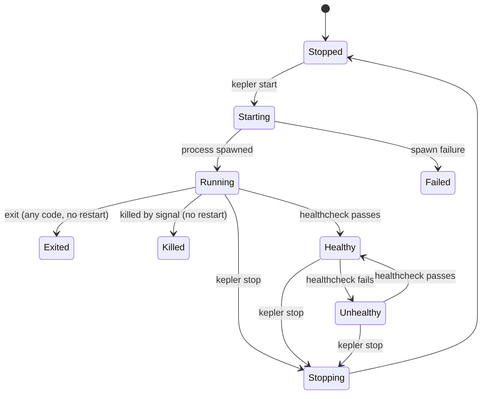

# Service Lifecycle

How services transition between states, how start modes work, and how quiescence is determined.

## Table of Contents

- [Service Status States](#service-status-states)
- [Status Display](#status-display)
- [Start Modes](#start-modes)
- [Startup Cluster vs Deferred Cluster](#startup-cluster-vs-deferred-cluster)
- [Foreground Quiescence](#foreground-quiescence)
- [Restart Behavior](#restart-behavior)
- [Stop Behavior](#stop-behavior)
- [Recreate](#recreate)

---

## Service Status States

Kepler services have 9 possible status states:

| Status | Description |
|--------|-------------|
| **Stopped** | Manually stopped via `kepler stop` |
| **Starting** | Service is in the process of starting |
| **Running** | Process is running (no healthcheck, or healthcheck not yet passed) |
| **Stopping** | Service is in the process of stopping |
| **Failed** | Spawn failure or dependency permanently unsatisfied |
| **Healthy** | Running and healthcheck is passing |
| **Unhealthy** | Running but healthcheck is failing |
| **Exited** | Process exited naturally with any exit code (no restart policy) |
| **Killed** | Process killed by signal |

### State Transitions



Key distinctions:
- **Exited** vs **Stopped**: Exited means the process exited naturally (any exit code) and won't restart. Stopped means it was manually stopped via `kepler stop`.
- **Killed** vs **Exited**: Killed means the process was terminated by a signal (SIGKILL, SIGTERM, etc.). Exited means the process exited on its own.
- **Failed** is reserved for infrastructure failures: spawn failures or permanently unsatisfied dependencies.
- **Stopped** is transient during restart (stop → start), so it should not be treated as a final state in automated workflows.

---

## Status Display

The `kepler ps` command shows status in a Docker-style format:

| State | Display Format | Example |
|-------|---------------|---------|
| Running | `Up <duration>` | `Up 5m` |
| Healthy | `Up <duration> (healthy)` | `Up 5m (healthy)` |
| Unhealthy | `Up <duration> (unhealthy)` | `Up 2m (unhealthy)` |
| Starting | `Starting` | `Starting` |
| Stopping | `Stopping` | `Stopping` |
| Stopped | `Stopped` | `Stopped` |
| Exited | `Exited (<code>) <duration> ago` | `Exited (0) 14s ago`, `Exited (1) 5s ago` |
| Killed | `Killed (<signal>) <duration> ago` | `Killed (SIGKILL) 3s ago` |
| Failed | `Failed <duration> ago` | `Failed 2s ago` |

The `kepler ps` output has three columns: **NAME**, **STATUS**, **PID**.

---

## Start Modes

Kepler supports three start modes that control how the CLI interacts with service startup:

| Flags | Blocks until | Then |
|-------|-------------|------|
| `kepler start` (no flags) | All services quiescent | Follows logs, Ctrl+C stops all |
| `kepler start -d` | Immediately | Returns |
| `kepler start -d --wait` | Startup cluster ready | Returns (deferred continue in background) |
| `kepler start -d --wait --timeout 30s` | Startup cluster ready OR timeout | Returns |

The same flags apply to `kepler restart`.

---

## Startup Cluster vs Deferred Cluster

Services are partitioned into two clusters based on their dependency conditions:

- **Startup cluster**: Services whose dependencies are all expected to resolve during normal startup (e.g., `service_started`, `service_healthy`, `service_completed_successfully`)
- **Deferred cluster**: Services with at least one dependency that waits for a reactive event (e.g., `service_failed`, `service_stopped`, `service_unhealthy`)

A service is in the startup cluster if **all** its dependency edges use startup conditions **and** all its dependency targets are also in the startup cluster. This propagates transitively.

See [Dependencies](dependencies.md#startup-vs-deferred-conditions) for the full computation algorithm and examples.

### How Clusters Affect Start Modes

| Mode | Startup cluster | Deferred cluster |
|------|----------------|-----------------|
| `start` (foreground) | Started level-by-level, blocking | Spawned in background after startup cluster |
| `start -d` | All started in background | All started in background |
| `start -d --wait` | Started level-by-level, blocking | Spawned in background, CLI returns |

---

## Foreground Quiescence

In foreground mode (`kepler start` without `-d`), the CLI follows logs and automatically exits when all services reach a **terminal** state.

Terminal states are:
- **Stopped** -- manually stopped (e.g. via `kepler stop` from another terminal)
- **Exited** -- process exited (any exit code)
- **Killed** -- process killed by signal
- **Failed** -- spawn failure or dependency permanently unsatisfied

If a deferred service's dependency is permanently unsatisfied (the dependency has stopped and won't restart), the deferred service is marked as Failed so the CLI can exit cleanly.

---

## Restart Behavior

### Restart Policies

| Policy | Behavior |
|--------|----------|
| `no` | Never restart (default) |
| `always` | Always restart on exit |
| `on-failure` | Restart only on non-zero exit |

### Restart Triggers

Services can restart due to:
1. **Restart policy** -- automatic restart after exit (based on policy and exit code)
2. **File watcher** -- file changes matching watch patterns
3. **Manual restart** -- `kepler restart` command
4. **Dependency restart** -- when `restart: true` is set on a dependency edge

See [Dependencies](dependencies.md#restart-propagation) for details on restart propagation.

---

## Stop Behavior

`kepler stop` sends a signal (default SIGTERM) to all services:

```bash
kepler stop              # SIGTERM
kepler stop -s SIGKILL   # Force kill
kepler stop --clean      # Stop and run cleanup hooks
```

Services transition: Running/Healthy/Unhealthy → Stopping → Stopped

The `--clean` flag runs the `pre_cleanup` hook after services are stopped. See [Hooks](hooks.md) for details.

---

## Recreate

The `recreate` command re-bakes the config snapshot without starting or stopping services:

```bash
kepler stop        # Must stop first
kepler recreate    # Re-bake config
kepler start       # Start with new config
```

This is necessary when:
- The original config file has changed
- Environment variables have changed
- `.env` files have been modified

See [Configuration](configuration.md#config-immutability) for details.

---

## See Also

- [CLI Reference](cli-reference.md) -- Command reference
- [Dependencies](dependencies.md) -- Dependency conditions, startup/deferred clusters
- [Health Checks](health-checks.md) -- Health check state transitions
- [Hooks](hooks.md) -- Lifecycle hooks
- [Configuration](configuration.md) -- Restart policy configuration
